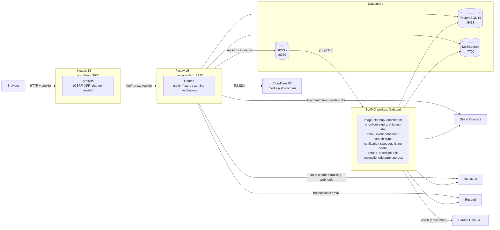
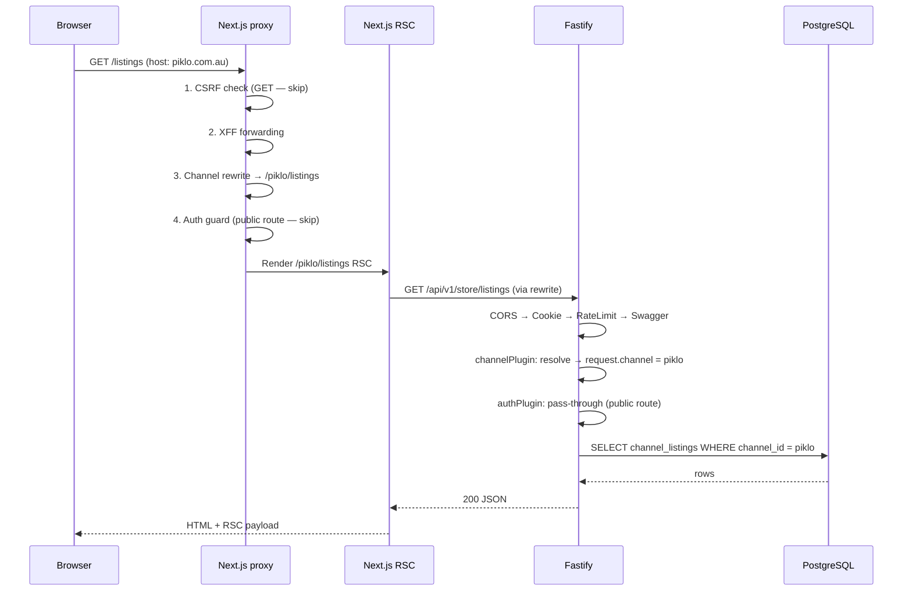
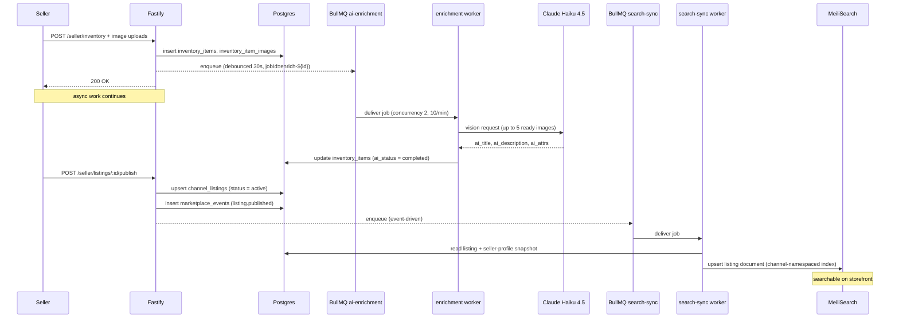

> **Provenance:** engine doc copied from `benobie/piklo-v2` @ `2419a38` at fork time (02/07/2026), with `@bushpop/*` renamed `@bushpop/*`. May drift from upstream — see `docs/engine/FORK.md`.

---
last-verified: 2026-05-03
---

# Architecture

> How Piklo V2 is structured. Read this before making cross-cutting changes.
> For payment-specific flows, see [STRIPE-MONEY-FLOW.md](STRIPE-MONEY-FLOW.md).

## System Overview



Source: `packages/api/src/server.ts`, `apps/web/next.config.ts`, `packages/api/src/workers/index.ts`

---

## Multi-Channel Architecture

Piklo and Bushpop share a single backend. The concept of a "channel" distinguishes them.

Source: `packages/config/src/channel-config.ts`, `packages/api/src/plugins/channel.ts`, `AGENTS.md` lines 93-98

### Table scoping

| Scope | Tables |
|---|---|
| Global | `users`, auth/session tables, `seller_profiles`, `inventory_items`, `inventory_item_images`, `addresses` |
| Channel-scoped | `channels`, `channel_listings`, `carts`, `cart_items`, `checkout_sessions` (legacy, W5 cutover), `order_groups`, `orders`, `marketplace_events`, analytics/search artefacts, `fees` |
| Inherited | `order_items`, `order_group_seller_allocations`, `order_group_allocation_items`, `allocation_refunds`, `payout_holds`, `disputes`, `refunds` |

### Channel config

Two channels are defined in `packages/config/src/channel-config.ts`:

| Slug | Domain | Platform fee | Status |
|---|---|---|---|
| `piklo` | `piklo.com.au` | 8% (800 bps) | Active |
| `bushpop` | `bushpop.com.au` | 10% (1000 bps) | Inactive |

`DEFAULT_CHANNEL` is `"piklo"`. The `CHANNELS` constant and `resolveChannelFromHost()` are the single source of truth for branding, URLs, and theme — nothing else should hard-code channel defaults.

### Channel resolution

The API resolves the current channel on every request via the `channelPlugin` (`packages/api/src/plugins/channel.ts`). Resolution priority:

1. `Host` header → matched against `channelsByDomain` map (refreshed every 5 minutes from the `channels` table).
2. `X-Channel` header → matched against `channelCache` map by slug.
3. Fallback to `DEFAULT_CHANNEL` (`"piklo"`).

The resolved `ChannelData` is attached to `request.channel` and available in all route handlers.

The web proxy sets the `X-Channel` header by rewriting the URL path to include a `[channel]` segment (see [The /api Proxy](#the-api-proxy) below). Local dev and preview deployments use host-map fallback.

---

## Request Lifecycle



### The /api Proxy

Source: `apps/web/src/proxy.ts`

`proxy.ts` (formerly `middleware.ts`) runs on every request matched by the `matcher` config. It handles four concerns in execution order:

**1. CSRF guard (FM-17)**
All non-GET `/api/*` requests must carry `X-Requested-With: XMLHttpRequest`. Missing → `403 Forbidden`. Prevents cross-site form POST attacks before the request reaches Fastify.

**2. XFF forwarding (FM-19)**
Copies `x-forwarded-for` / `x-real-ip` from the incoming request headers into the forwarded request headers so Fastify's rate limiter sees the real client IP, not `127.0.0.1`.
> Note: headers must be set on `NextResponse.next({ request: { headers } })`, not on the response — upstream never sees response headers.

**3. Channel rewrite (LB-1)**
Calls `resolveChannelFromHost(request.headers.host)` from `@bushpop/config`, then rewrites `/path` → `/[channel]/path` if not already prefixed. This maps the `[channel]` dynamic segment in `apps/web/src/app/[channel]/...`.

**4. Optimistic auth guard (FM-1)**
Checks for a `better-auth.session_token` or `__Secure-better-auth.session_token` cookie. If absent on a protected prefix (`/account`, `/dashboard`, `/sell`, `/checkout`), redirects to `/[channel]/sign-in`. This is a UX guard only — not a trust boundary. Actual session validation happens in `requireAuth` on the API.

### Fastify Middleware Chain

Source: `packages/api/src/server.ts`

Plugin registration order is load-bearing in Fastify. Plugins decorate the request/reply objects; later plugins can depend on earlier ones.

| Order | Plugin / hook | Purpose |
|---|---|---|
| 1 | `@fastify/cors` | `Origin` whitelist for web + admin URLs, `credentials: true` |
| 2 | `@fastify/cookie` | Cookie parsing (needed by Better Auth session resolution) |
| 3 | `@fastify/rate-limit` | Global 100 req/min; `/api/auth/*` gets a tighter 10 req/min limit |
| 4 | `@fastify/swagger` + `swagger-ui` | OpenAPI 3.1 generation via `jsonSchemaTransform`; UI at `/docs` |
| 5 | `channelPlugin` | Resolves `request.channel` on every request |
| 6 | `authPlugin` | Proxies `/api/auth/*` to Better Auth handler |
| 7 | Error handler | `setErrorHandler` — routes `AppError`, `InvalidTransitionError`, Zod validation errors |
| 8 | `registerIdempotencyHook` | Registers the `onSend` hook that persists idempotency responses |
| 9 | Routes | All route families registered in order (health, channels, me, seller/*, store/*, admin/*, webhooks/*) |

MeiliSearch bootstrap runs in `onReady` (after plugins, before `app.listen()`). Skipped in `NODE_ENV=test`.

---

## Error Hierarchy

Source: `packages/api/src/lib/errors.ts`, `packages/api/src/lib/state-machine.ts`, `packages/api/src/routes/v1/store/cart/service.ts`

All domain errors extend `AppError` and are caught by `setErrorHandler`.

| Class | HTTP status | Code string | Notes |
|---|---|---|---|
| `AppError` | 500 (default) | custom via constructor | Base class |
| `NotFoundError` | 404 | `NOT_FOUND` | |
| `UnauthorisedError` | 401 | `UNAUTHORISED` | Thrown by `requireAuth` |
| `ForbiddenError` | 403 | `FORBIDDEN` | |
| `ConflictError` | 409 | `CONFLICT` | Also used by idempotency middleware |
| `ValidationError` | 422 | `VALIDATION_ERROR` | Optional `errors` field for field-level messages |
| `TooManyRequestsError` | 429 | `TOO_MANY_REQUESTS` | |
| `InvalidTransitionError` | 422 | `INVALID_TRANSITION` | From `packages/api/src/lib/state-machine.ts` — caught separately |
| `MultiSellerCheckoutNotSupportedError` | 422 | `MULTI_SELLER_CHECKOUT_UNSUPPORTED` | ADR-015 Sprint 1b W1 temporary shim. Thrown at checkout time when cart has items from 2+ sellers. Removed in W5 when multi-seller checkout ships. |

Retired in Sprint 1b W1:
- `SellerMismatchError` (422 `SELLER_MISMATCH`) — cart is now multi-seller per ADR-015; the single-seller guard moved from cart-add to checkout-time via `MULTI_SELLER_CHECKOUT_UNSUPPORTED` above.

Zod schema validation errors (status 400 or `error.validation` truthy) are normalised to `{ error: "VALIDATION_ERROR", message }`.

---

## Authentication Model

Source: `packages/api/src/plugins/auth.ts`, `packages/api/src/middleware/require-auth.ts`

Better Auth v1.5.6 with Fastify adapter (ADR-002). Key properties:

- **Session storage:** PostgreSQL via the Drizzle adapter. Better Auth owns its own tables (`user`, `session`, `verification`, `account`); application tables (`user_roles`, `addresses`, `seller_profiles`) carry a FK to `user.id`.
- **Auth routes:** `/api/auth/*` are handled entirely by `authPlugin`, which translates Fastify's `req`/`reply` into Web API `Request`/`Response` objects and delegates to `auth.handler()`. Tighter rate limit: 10 req/min.
- **Per-domain sessions:** Each channel domain gets its own session cookie (cookie name scoped by domain in Better Auth config). The cookie is forwarded first-party through Next.js's same-origin `/api` rewrite (ADR: LB-2).
- **Protected routes:** Route handlers that need an authenticated user add `requireAuth` as a `preHandler`. `requireAuth` calls `auth.api.getSession()` and attaches `request.user` and `request.sessionId`. Throws `UnauthorisedError` (401) if no valid session.
- **Role enforcement:** `requireRole(role)` middleware (not shown separately) checks `request.user` against the `user_roles` table.
- **SSR vs browser clients:** `createAuthedApiClient()` in `packages/api-client/src/server.ts` reads cookies via `next/headers` and forces dynamic rendering. `createPublicApiClient()` uses plain fetch and is safe inside `'use cache'` scopes.

---

## State Machines

Source: `docs/state-machines.md`, `packages/api/src/lib/*machines.ts`

All status fields use an explicit state machine. Invalid transitions throw `InvalidTransitionError` (409).

| Entity | Field | States | Details |
|---|---|---|---|
| Inventory item | `lifecycle_state` | `owned`, `for_sale`, `offer_only`, `inventory_only`, `sold`, `archived` | See [state-machines.md](state-machines.md#inventory-item) |
| Inventory item | `availability_status` | `available`, `reserved`, `sold` | Managed by checkout initiation/expiry/payment |
| Inventory item | `ai_status` | `none`, `processing`, `completed`, `failed` | Managed by enrichment worker |
| Channel listing | `status` | `draft`, `active`, `paused`, `sold`, `archived` | Cascades from inventory lifecycle |
| Checkout session | `status` | `created`, `payment_pending`, `requires_action`, `expired`, `succeeded`, `failed`, `abandoned`, `refunded_after_expiry` | See [state-machines.md](state-machines.md#checkout-session) |
| Order | `status` | `paid`, `shipped`, `delivered`, `completed`, `cancelled` | `completed` exists in types but no current code path writes it |
| Payout hold | `status` | `held`, `blocked`, `releasing`, `released`, `refunded` | Two-phase CAS release pattern |
| Image | `status` | `pending`, `ready`, `failed` | Set by upload confirmation flow |

### Payout Hold State

> Canonical state machine: see [`state-machines.md#payout-hold`](state-machines.md#payout-hold).

---

## Worker Architecture

Source: `packages/api/src/workers/index.ts`, `docs/workers.md`

Workers are started by `startWorkers()` in `packages/api/src/index.ts` alongside Fastify. They are skipped entirely in `NODE_ENV=test`. The enrichment worker only starts when `ANTHROPIC_API_KEY` is present.

| Worker | Queue | Schedule | Purpose |
|---|---|---|---|
| `imageCleanup` | `image-cleanup` | Cron every 60 min | Deletes orphaned R2 uploads and DB rows for `pending` images >1h old or `failed` images |
| `enrichment` | `ai-enrichment` | On-demand (debounced 30s) | Calls Claude Haiku 4.5 with up to 5 ready images, writes `ai_*` fields; concurrency 2, rate-limited 10/min |
| `checkoutExpiry` | `checkout-expiry` | Delayed (per-session) + sweep every 5 min | Expires sessions, releases inventory, cancels Stripe PaymentIntents |
| `shippingLabel` | `shipping-label` | On-demand (post-payment) | Creates StarShipIt shipment, persists `trackingNumber` / `trackingCarrier` to order |
| `email` | `email` | On-demand (post-payment) | Sends buyer/seller order confirmation via Resend; concurrency 1, rate-limited 2/s |
| `eventConsumer` | `marketplace-events` | On-demand | Marks `marketplace_events.delivery_status = "delivered"` |
| `searchSync` | `marketplace-events` | On-demand | Upserts/removes MeiliSearch listing documents on listing and seller profile events |
| `notificationSweeper` | — | Recurring | Sweeps and cleans stale notifications. **Baseline rate-limit values (pending Sprint 1b reconciliation with live code):** 3 notifications/user/day cap, 24h dedup window, quiet hours 22:00–08:00 AEDT. Verify against the ported service before wiring new notification producers. |
| `listingScore` | — | Recurring | Recalculates listing relevance scores |
| `refund` | — | On-demand | Processes refund operations through the payment WAL |
| `starshipitPoll` | — | Cron (recurring) | Polls StarShipIt for tracking updates, writes `shipped → delivered` transitions |
| `reconcileIndeterminateOps` | — | Cron (recurring) | Reconciles `payment_operations` rows stuck in `processing` status |
| `backfillAspectRatios` | — | One-off on startup | Backfills `aspect_ratio` on existing images missing the field |

### Event Dispatch Pattern

```
service layer
  └─ dispatchEvent({ eventName, ... })
       ├─ INSERT marketplace_events (delivery_status = "pending")
       └─ BullMQ enqueue (job name = eventName)
            ├─ eventConsumer: marks delivery_status = "delivered"
            └─ searchSync: upserts/removes MeiliSearch docs
```

> Caution: `eventConsumer` and `searchSync` share the `marketplace-events` BullMQ queue. BullMQ workers compete for jobs — this is not pub-sub fan-out. Any job claimed by `searchSync` bypasses the `delivery_status` update. See `docs/workers.md` for the full list of sharp edges. See ADR-009 for the decision rationale.

**Partition threshold (deferred):** When `marketplace_events` volume exceeds **~1M rows/month**, plan a monthly partition migration. Currently a single heap table — no partitioning configured. Monitor row count as event traffic grows so the cutover can be scheduled before query latency becomes a problem.

### Inventory → Listing → Search (async path)

Two async hops sit between an inventory upsert and a search-visible listing: enrichment (Claude vision, debounced) and search-sync (event-driven). Both are at-least-once; idempotency is provided by ULID jobIds and entityId-keyed event handlers.



---

## Caching Model (Next.js 16)

Source: `apps/web/next.config.ts`, `packages/api-client/src/server.ts`, `packages/api-client/src/cache-tags.ts`, `apps/web/src/lib/data/listings.ts`

Next.js 16's Cache Components model is enabled via `cacheComponents: true` in `next.config.ts`. Without this flag, `'use cache'` and `cacheLife()` are no-ops.

### Named cache profiles

Defined in `next.config.ts` → `cacheLife`:

| Profile | `stale` | `revalidate` | Used by |
|---|---|---|---|
| `browse` | 60s | 3600s | `browseListings` |
| `listing-detail` | 300s | 3600s | `getListing` |
| `search` | 0s | 60s | `searchListings` |

Profile names must match across both read sites (`apps/web/src/lib/data/*.ts`) and invalidation sites (Server Actions). Use `scripts/cache-audit.sh` to detect drift.

### Belt-and-braces tagging pattern

Data fetchers inside `'use cache'` register tags via two mechanisms:

```
'use cache'
cacheLife('listing-detail')
cacheTag(channelListingTag(channel, handle))        // (a) binds function-cache entry
const api = createPublicApiClient({
  tags: [channelListingTag(channel, handle)]        // (b) forwards to fetch.next.tags
})
```

Both mechanisms write to the same global tag namespace but bind to different cache entries. Tagging only one leaves the other intact when `revalidateTag(tag, 'profile')` fires from a Server Action.

### Channel-namespaced tags

Source: `packages/api-client/src/cache-tags.ts`

All cache tags go through `channelTag()` helpers to prevent cross-channel cache contamination:

| Helper | Example output |
|---|---|
| `channelListingsTag('piklo')` | `channel:piklo:listings` |
| `channelListingTag('piklo', 'abc')` | `channel:piklo:listing:abc` |
| `channelTag('piklo', 'seller', 'def')` | `channel:piklo:seller:def` |

Bare `revalidateTag('listings')` would purge both channels simultaneously — never use it.

### Client factories

Source: `packages/api-client/src/server.ts`

| Factory | Use case | Notes |
|---|---|---|
| `createPublicApiClient(options?)` | RSC data fetchers inside `'use cache'` | Plain fetch, supports `tags`/`revalidate` options. Do NOT call from authed context. |
| `createAuthedApiClient()` | Routes requiring session cookies | Reads `cookies()` from `next/headers`; forces dynamic rendering. Must NOT be called inside `'use cache'` scope. |

---

## API Contract

Source: `packages/api/src/server.ts`, `packages/api-client/src/schema.d.ts`

- Schemas are defined in Zod at the route level and transformed to JSON Schema via `jsonSchemaTransform` before `@fastify/swagger` processes them. Raw `ZodType` objects would crash on internal null properties without this transform.
- OpenAPI 3.1 spec is served at `/docs`.
- TypeScript types are generated from the spec into `packages/api-client/src/schema.d.ts`.
- Both client factories are typed via `createClient<paths>` from `openapi-fetch`.
- CI enforces that the generated types are current (schema drift fails the build).

---

## Idempotency

Source: `packages/api/src/middleware/idempotency.ts`

Prevents duplicate side effects on retried POST/PUT/PATCH requests. Design mirrors Stripe's idempotency model with a 24-hour TTL.

### Two-part implementation

**Part 1 — `idempotencyMiddleware` (preHandler)**
Routes that opt in add `idempotencyMiddleware` as a `preHandler`. On each request:
1. If no `Idempotency-Key` header: skip (no-op).
2. Look up `(key, userId, operation)` triplet in `idempotency_keys` table.
   - `processing` → throw `ConflictError(409)` (request in flight).
   - `completed` → return cached `responseStatus` + `responseBody` with `X-Idempotent-Replayed: true` header.
   - Not found → `INSERT` with `status = "processing"`, attach context to `request.idempotencyContext`.

The `operation` is `"METHOD:routePattern"` (e.g. `"POST:/api/v1/store/checkout"`), scoping the key to a specific endpoint.

**Part 2 — `registerIdempotencyHook` (onSend)**
Registered once at server startup in `server.ts`. On every response:
- If `request.idempotencyContext` is set, `UPDATE idempotency_keys SET status="completed", responseStatus, responseBody`.
- Errors in the `onSend` hook are logged but do not alter the response.

### Key properties

- Scoped by `(idempotency-key header, userId, operation)` — keys from different users or routes never collide.
- 24h TTL (matches Stripe's TTL).
- Separate from the `payment_operations` WAL used for Stripe crash recovery (see [STRIPE-MONEY-FLOW.md](STRIPE-MONEY-FLOW.md)).

---

## Key Architectural Decisions

Source: `docs/DECISIONS.md`

| ADR | Decision | Summary |
|---|---|---|
| ADR-001 | Custom Fastify+Drizzle over Medusa v2 | Medusa's DI container and module system added friction; multi-channel support fought its architecture |
| ADR-003 | ULIDs for all primary keys | Sortable by creation time, URL-safe, 26 chars vs 36 for UUIDs |
| ADR-004 | Channel architecture over brand/tenant | "Channel" models distribution surfaces (Piklo, Bushpop) with separate domains, fees, and themes |
| ADR-005 | Drizzle 0.45.x, pin away from v1.0 beta | v1.0 beta breaks migration architecture; stay on stable until GA |
| ADR-009 | Simplified event dispatch (write + enqueue) | No outbox polling — `dispatchEvent()` writes `marketplace_events` and enqueues BullMQ directly |
| ADR-011 | Separate charges and transfers (supersedes ADR-010) | Platform charges buyer; issues Stripe transfers to sellers on its own schedule. Chargeback liability on platform, payout timing controlled by payout hold state machine |

See `docs/DECISIONS.md` for the full record including ADR-002 (Better Auth), ADR-006 (BullMQ Job Schedulers), ADR-007 (Better Auth owns auth tables), ADR-008 (Drizzle schema by domain), ADR-012 (admin cancel through RefundService).

---

## Cross-References

| Document | Covers |
|---|---|
| [STRIPE-MONEY-FLOW.md](STRIPE-MONEY-FLOW.md) | Charge/transfer flow, payout hold lifecycle, WAL pattern, refund paths |
| [DECISIONS.md](DECISIONS.md) | Full ADR log |
| [state-machines.md](state-machines.md) | All state machines with Mermaid diagrams and transition tables |
| [EDGE-CASES.md](EDGE-CASES.md) | Known edge cases and compensating flows |
| [api-routes.md](api-routes.md) | Complete route inventory with auth requirements |
| [workers.md](workers.md) | Worker inventory with queue topology, concurrency, and known sharp edges |
| [events.md](events.md) | Event catalogue with producer/consumer map |
| [erd.md](erd.md) | Entity-relationship diagram |
