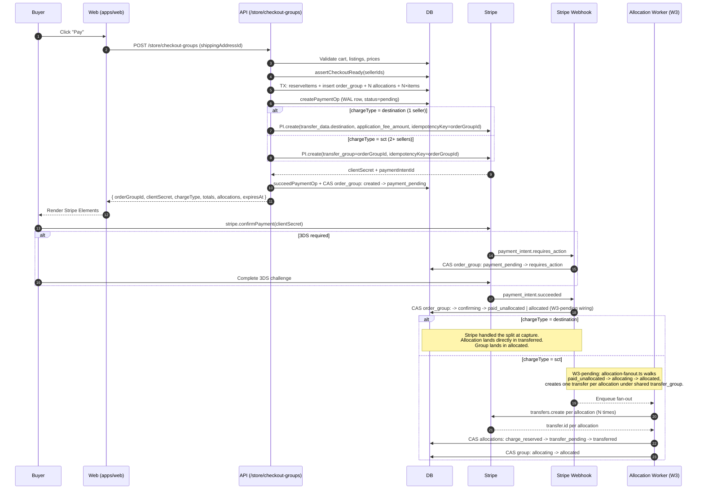

> **Provenance:** engine doc copied from `benobie/piklo-v2` @ `2419a38` at fork time (02/07/2026), with `@bushpop/*` renamed `@bushpop/*`. May drift from upstream — see `docs/engine/FORK.md`.

---
last-verified: 2026-05-03
---

# Checkout Flow

> End-to-end narrative for the multi-vendor checkout: cart → quote → PaymentIntent → confirm → split. Read this before touching anything in `packages/api/src/routes/v1/store/checkout-groups/`, the Stripe webhook, or the cart routes.

ADR-015 ([DECISIONS.md § ADR-015](DECISIONS.md)) reshaped checkout from a single-seller `checkout_sessions` row into an `order_groups` orchestration entity with per-seller `order_group_seller_allocations`. One group holds the whole checkout regardless of how many sellers it spans, and a `chargeType` discriminator drives a hybrid Stripe model — destination charges for single-seller carts, separate charges and transfers (SC&T) for multi-seller carts. This doc walks the full happy path plus the failure modes so a new dev can read top-to-bottom and have the whole story in one place.

See also: [ARCHITECTURE.md](ARCHITECTURE.md) (system overview), [state-machines.md](state-machines.md) (canonical status machines), [PAYMENT-FLOW.md](PAYMENT-FLOW.md) (money-flow developer reference), [STRIPE-MONEY-FLOW.md](STRIPE-MONEY-FLOW.md) (Connect mechanics, original design doc), [DISPUTES-AND-REFUNDS.md](DISPUTES-AND-REFUNDS.md) (refund + dispute paths), [DECISIONS.md](DECISIONS.md) (ADR-011, 015, 017, 018), [AGENTS.md](../AGENTS.md) (Stripe 5xx + refund-flag-independence gotchas).

## Cart

The cart is multi-seller. There is **no `cart.seller_id` column** — Sprint 1b W1 dropped it as part of the ADR-015 cutover, along with the `SellerMismatchError` and the legacy single-seller "Replace bag?" modal. The seller for any given cart item is derived through the join `cart_items → channel_listings → inventory_items.owner_id`.

Endpoints under [`packages/api/src/routes/v1/store/cart/routes.ts`](../packages/api/src/routes/v1/store/cart/routes.ts):

| Method | Path | Purpose |
|---|---|---|
| `POST` | `/api/v1/store/cart/items` | Add a `channel_listing_id` to the buyer's cart |
| `GET`  | `/api/v1/store/cart` | Return the buyer's current cart, or `null` if empty |
| `DELETE` | `/api/v1/store/cart/items/:id` | Remove a single cart item |
| `DELETE` | `/api/v1/store/cart` | Clear the entire cart (idempotent) |

Schema for `carts` and `cart_items` lives in [`packages/db/src/schema/commerce.ts`](../packages/db/src/schema/commerce.ts). Each `cart_item` snapshots `priceCents` and `currency` at add-to-cart time — that snapshot is what the quote validates against the live listing later.

Cart lifecycle:

- Carts persist across browser sessions for the buyer + channel pair.
- The cart row itself is **not deleted** at order time. On `payment_intent.succeeded`, only `cart_items` are removed; the `cart` row is left orphaned by design because `checkout_sessions.cartId` (legacy) holds a non-cascading FK. Cleanup of orphan cart rows is tracked as a Phase 2B follow-up — see [`webhooks/stripe.ts`](../packages/api/src/routes/v1/webhooks/stripe.ts) comment on `R3: zombie cart fix`.

## Quote

`POST /api/v1/store/checkout-groups` is the single entry point that turns a cart into a priced, reserved, Stripe-ready checkout group. The full flow lives in [`createQuoteAndPaymentIntent` in service.ts](../packages/api/src/routes/v1/store/checkout-groups/service.ts) — the steps below summarise it.

1. **Load + validate cart.** Cart for `(buyerId, channelId)` must exist and have at least one item.
2. **Active-group guard.** Reject if any other `order_groups` row on this `cart_id` is still in `ORDER_GROUP_ACTIVE_STATUSES = (created, payment_pending, requires_action, confirming)`. Enforced in code AND at the DB level by partial unique index `order_groups_cart_active_unique`.
3. **Listing + price re-validation.** Join through `cart_items → channel_listings → inventory_items`. Reject if any listing is no longer `active`, has been hidden, or its current `priceCents` no longer matches the cart-item snapshot.
4. **Address validation.** Buyer's `shippingAddressId` must belong to them and not be soft-deleted.
5. **Channel config + seller readiness.** Load `channels.platformFeeBps` (default 800 = 8%) and `channels.currency` (default `AUD`). For each distinct seller in the cart, call `assertCheckoutReady(sellerId)` — fail-fast on a Connect account that isn't `charges_enabled` or hasn't completed Stripe onboarding. Resolve each seller's `seller_profiles.stripe_account_id`.
6. **Per-seller totals.** Group cart items by `inventory_items.owner_id`. For each seller compute:
   - `subtotalCents = Σ priceCents` over their items.
   - `shippingCents` from `@bushpop/config/shipping` `calculateShipping(shippingClasses)` — highest class rate plus an additional-item surcharge.
   - `platformFeeCents = round(subtotalCents × platformFeeBps / 10_000)`.
   - `sellerProceedsCents = (subtotal + shipping) − platformFee`.

   The group totals are the sums of the per-seller totals.
7. **Charge-type decision.** `chargeType = sellerIds.length === 1 ? "destination" : "sct"`. Single-seller → Stripe handles the split. Multi-seller → platform handles it via separate transfers (see [Single-seller path](#single-seller-destination-charge-path) and [Multi-seller path](#multi-seller-sct-path) below).
8. **`quoteHash`.** SHA-256 over the canonical sorted allocations (sellerId asc, itemIds asc within each). This is the **LB-M1 conservation anchor** — at capture time the webhook can re-derive the hash and reject any drift between quote and capture. It locks the price-and-allocation snapshot into the group row.
9. **DB transaction.** Inside one transaction:
   - `reserveItems(targets)` — best-effort version-gated reservation. If two buyers race, the loser sees `409 CONFLICT` here (see [Failure modes](#failure-modes)).
   - Insert one `order_groups` row (`status = "created"`, `chargeType`, totals, `quoteHash`, `expiresAt = now + 30 min`).
   - Insert N `order_group_seller_allocations` rows (`status = "pending"`, per-seller money snapshot).
   - Insert N×items into `order_group_allocation_items` (per-item granularity for refunds).
10. **WAL row (LB-F8).** `createPaymentOp(orderId=null, type="charge", idempotencyKey=orderGroupId, amount=groupTotal, orderGroupId)` writes a `payment_operations` row with `status = "pending"` **before** the Stripe call. The WAL row is what makes a crash-mid-Stripe-call recoverable.
11. **Stripe `paymentIntents.create`.** Idempotency key is `orderGroupId`. Branches on `chargeType`:
    - `destination`: pass `transfer_data.destination = singleSeller.stripeAccountId` and `application_fee_amount = singleAllocationPlatformFee`. Stripe routes funds and deducts the fee at capture time.
    - `sct`: pass `transfer_group: orderGroupId` (no `transfer_data`, no `application_fee_amount`). Funds capture to the platform balance; the platform fans out transfers later.
    Metadata always carries `{ orderGroupId, buyerId, chargeType, channelId, allocationIds }`.
12. **Success path.** `succeedPaymentOp(opId, stripePaymentIntentId)` flips the WAL row to `succeeded`, then a CAS update sets `order_groups.status created → payment_pending` and stamps `stripe_payment_intent_id` + `stripe_client_secret`.
13. **Return quote.** Response carries `{ orderGroupId, clientSecret, chargeType, totals, allocations[], expiresAt }`. The buyer's web client uses `clientSecret` with Stripe Elements to confirm the PaymentIntent.

The order-group state machine for `created → payment_pending` and beyond is canonical in [`state-machines.md#order-group`](state-machines.md#order-group). Per-seller allocation states (`pending → charge_reserved → transfer_pending → transferred → …`) are at [`state-machines.md#per-seller-allocation`](state-machines.md#per-seller-allocation).

The cancel endpoint `POST /api/v1/store/checkout-groups/:id/cancel` allows the buyer to abandon a quote. CAS-transitions `created | payment_pending → cancelled`, releases reserved inventory, and best-effort cancels the Stripe PaymentIntent. **Cancellation is rejected from any other state** — once the buyer has pulled a 3DS challenge or post-payment work has begun, the group is no longer cancellable from the buyer side.

## Confirm

After the quote returns a `clientSecret`, the buyer confirms the PaymentIntent client-side via Stripe Elements. The Stripe webhook (`POST /api/v1/webhooks/stripe`) drives the post-confirm transitions:

| Webhook event | Target transition (per `state-machines.md#order-group`) |
|---|---|
| `payment_intent.requires_action` | `payment_pending → requires_action` (3DS challenge raised) |
| `payment_intent.succeeded` | `payment_pending | requires_action → confirming → paid_unallocated | allocated` |
| `payment_intent.payment_failed` | `payment_pending | requires_action → payment_declined`; release inventory |

The 3DS branch is async. On a card that requires SCA, the buyer's confirmation may take several seconds — Stripe sends `requires_action` first, the customer completes the challenge, then `succeeded` arrives. The buyer's client polls `GET /api/v1/store/checkout-groups/:id` to surface progress.

> **W3-pending caveat.** The live `payment_intent.succeeded` handler in [`packages/api/src/routes/v1/webhooks/stripe.ts`](../packages/api/src/routes/v1/webhooks/stripe.ts) `handlePaymentIntentSucceeded` still operates on `checkout_sessions` rows for the legacy single-seller flow. Order-group webhook wiring — looking up the group by `stripe_payment_intent_id`, CAS-transitioning the order-group machine, creating per-allocation `orders` rows, kicking off allocation fan-out — lands with the W3 backend cohort (`sprint-1b-w3`). Until W3 ships, multi-vendor PaymentIntents created via `POST /store/checkout-groups` reach Stripe successfully but **the group will not auto-progress past `payment_pending`** if the webhook fires today; manual recovery would be needed if the path were exercised in production. The order-group machine in `state-machines.md` documents the target transitions; this doc is the narrative contract those transitions implement.

## Single-seller (destination charge) path

When `chargeType = "destination"` (cart contains exactly one distinct seller), Stripe handles the money split natively. Mechanics:

- One `PaymentIntent` with `transfer_data.destination = seller.stripeAccountId` and `application_fee_amount = platformFeeCents`.
- At capture, Stripe deducts the application fee onto the platform balance and transfers the remainder to the seller's connected account in a single atomic step.
- The single per-seller allocation skips `transfer_pending` and `transfer_retrying` entirely and lands directly in `transferred` once the webhook progresses it (W3).
- The order group skips `paid_unallocated` and `allocating` and lands directly in `allocated`.

This path is the fastest, simplest, and lowest-risk: there's no platform-balance transit window, the seller sees funds in their Connect account on capture, and refunds use Stripe's native flag set. See [STRIPE-MONEY-FLOW.md](STRIPE-MONEY-FLOW.md) for the Connect Express mechanics and [DECISIONS.md § ADR-011](DECISIONS.md) for why the platform retains MoR status even on destination charges.

## Multi-seller (SC&T) path

When `chargeType = "sct"` (cart spans 2+ sellers), Stripe cannot route funds to multiple connected accounts inside one PaymentIntent. The platform takes on the split:

- One `PaymentIntent` with `transfer_group: orderGroupId`, no `transfer_data`, no `application_fee_amount`. Funds capture to the platform balance.
- `payment_intent.succeeded` flips the group `confirming → paid_unallocated` and the per-seller allocations from `pending → charge_reserved`.
- The allocation fan-out worker walks the group `paid_unallocated → allocating → allocated`, creating one `stripe.transfers.create({ destination, amount, transfer_group })` per allocation. The shared `transfer_group` is what makes atomic reversal possible if a refund fans out across the cohort.
- Per-allocation fee math is **manual**: each allocation snapshots `platformFeeCents` at quote time. The fan-out short-pays each transfer by that allocation's fee. There is no Stripe-side `application_fee` to reconcile, just `totalCents − transferredCents` summed across allocations.
- Each successful transfer flips its allocation `charge_reserved → transfer_pending → transferred`. Failures land in `transfer_retrying` (transient) or `transfer_blocked` (manual intervention).

> **W3 future-tense.** [`packages/api/src/workers/allocation-fanout.ts`](../packages/api/src/workers/allocation-fanout.ts) does not yet exist — the fan-out worker is part of the W3 backend cohort. The `partially_failed` group state and the admin retry route that drives `partially_failed → allocating → allocated` also land with W3. Treat this entire path as **design + partial implementation**: the quote endpoint produces the correct `order_groups` + `order_group_seller_allocations` rows in production, but the post-payment lifecycle is W3.

ADR-018 ([DECISIONS.md § ADR-018](DECISIONS.md)) imposes binding operational controls on this path that any change here must preserve:

- **Zero-balance enforcement.** If fan-out fails to complete within 60 minutes of `payment_intent.succeeded`, the system MUST auto-refund the buyer and mark the order failed. Piklo does not hold funds overnight for manual retry — that would breach the Part 5 incidental-transfer characterisation.
- **AUD-only sellers** at launch. NZ / UK / cross-border seller support is deferred pending Stripe Connect country capabilities and an AML/CTF re-review.
- **Hard per-cart cap.** Multi-seller cart total capped (council recommended ≈ AUD $1,000; final value finalised in W3 product scope).
- **No internal stored value.** No seller wallets, no credits, no netting between orders.

Any code change that weakens these controls is a Priority 1 ADR re-review.

## Diagrams

### Diagram #4 — Cart → Quote → PaymentIntent (sequence)

### Diagram #6 — see PAYMENT-FLOW.md

The destination-vs-SC&T money-flow diagram lives at [`PAYMENT-FLOW.md` § Stripe Connect Model](PAYMENT-FLOW.md#stripe-connect-model). Refreshed by this PR alongside `CHECKOUT-FLOW.md`.

## Failure modes

The checkout-groups service catches each failure mode at a specific step and leaves the system in a recoverable state. Cross-link to [`state-machines.md#order-group`](state-machines.md#order-group), [`state-machines.md#per-seller-allocation`](state-machines.md#per-seller-allocation), and [`state-machines.md#refund`](state-machines.md#refund) for the canonical transitions.

### Inventory race

`reserveItems` is **best-effort, not a hard lock.** Two buyers can race for the same item; the loser receives a `409 CONFLICT` because the version-gated UPDATE updates 0 rows. The first buyer's quote completes; the second buyer must remove the contested item and re-quote. The active-group partial unique index `order_groups_cart_active_unique` also prevents the same buyer from creating two competing groups against the same cart.

### Price drift

Step 3 of the quote re-validates each cart item's snapshot `priceCents` against the live `channel_listings.priceCents`. Any mismatch throws `ValidationError` before reservation. The error message instructs the buyer to remove and re-add the item. There is no silent `expectedTotalCents` defence in the current implementation — that is tracked under a future `409 CHECKOUT_STALE` improvement.

### Stripe 4xx during PI create

`failPaymentOp(opId, error)` flips the WAL row to `failed`. The order group CASes `created → expired`, `releaseItems(inventoryItemIds)` returns reserved inventory, and the route returns `502 STRIPE_ERROR`. The buyer needs a fresh quote to retry — the `orderGroupId` idempotency key is now associated with a 4xx in Stripe's cache.

### Stripe 5xx during PI create

This is the **indeterminate path** and follows the WAL discipline strictly. `markIndeterminate5xx(opId, error)` flips the WAL row to `indeterminate_5xx` and sets `order_groups.has_pending_reconciliation = true`. The order group **stays in `created`** — a 5xx may have created the PI on Stripe's side or may not have, and the system cannot tell from the failure alone. The route returns `502 STRIPE_5XX`.

Recovery is out-of-band:

- The `reconcile-indeterminate-ops` cron (every 15 min, `Australia/Sydney`) calls Stripe's List API filtered by `metadata.piklo_payment_op_id` and reconciles the WAL row + drives the group to its terminal status.
- The `payment_intent.{succeeded, failed}` webhook arrives if Stripe did create the PI, and finalises the row.

**Never rotate the idempotency key on 5xx.** Stripe caches the 5xx under the original key for 24h; replaying the original POST returns the cached 5xx, not the underlying truth. See [`AGENTS.md`](../AGENTS.md) "Stripe 5xx is indeterminate" and "Stripe idempotency keys are POST-only" gotchas.

### 3DS abandoned

The buyer pulls a 3DS challenge but never completes it. The group sits in `requires_action` with reservations held until the 30-minute expiry sweeps it `→ expired` and releases inventory. The order-group expiry worker ([`packages/api/src/workers/order-group-expiry.ts`](../packages/api/src/workers/order-group-expiry.ts)) is **W3 future-tense**; until W3 ships, expiry of order-group rows is not yet automated.

### Card declined

`payment_intent.payment_failed` arrives. The order group CASes `payment_pending | requires_action → payment_declined` and `releaseItems` returns the inventory. The buyer can re-quote; their cart is unchanged.

### Webhook missed or duplicated

Stripe at-least-once delivery is handled by:

- `(provider, event_id)` dedup table (`isWebhookProcessed` / `markWebhookProcessed`). Repeated deliveries return `200 { duplicate: true }` without re-running the handler.
- CAS guards on every status transition. A second arrival hits an already-transitioned row and updates 0 rows → no double-fire effects.
- `deadLetterWebhook` captures any handler that throws; on-call is paged via the dead-letter queue.

### Refund-flag independence (destination-charge refunds)

When a destination-charge order is refunded, the Stripe `refunds.create` call carries two **independent** flags:

- `reverse_transfer: true` — gate this on `charge.transfer_data.destination != null` alone.
- `refund_application_fee: true` — gate this on `charge.application_fee_amount > 0` alone.

**Do not couple them into one `isDestinationCharge` boolean.** A destination charge with zero application fee still needs `reverse_transfer: true` (seller received the transfer, it must be reversed) but must NOT pass `refund_application_fee` (Stripe errors `application_fee_not_found`). Same-model code review will not catch this — rescue to a different model for any PR touching Connect refunds. See [`AGENTS.md`](../AGENTS.md) LB-F7 and [`packages/api/src/routes/v1/store/checkout/service.ts`](../packages/api/src/routes/v1/store/checkout/service.ts) `handlePaymentAfterExpiry`.

For the full refund pipeline (pre-transfer vs post-transfer paths, `seller_debts`, dispute freezes), see [DISPUTES-AND-REFUNDS.md](DISPUTES-AND-REFUNDS.md) and [`state-machines.md#refund`](state-machines.md#refund).

## Cross-references

- [ARCHITECTURE.md](ARCHITECTURE.md) — system overview, surface diagrams (post Phase A).
- [state-machines.md](state-machines.md) — canonical machines for [order-group](state-machines.md#order-group), [per-seller-allocation](state-machines.md#per-seller-allocation), [refund](state-machines.md#refund), [order](state-machines.md#order), [payout-hold](state-machines.md#payout-hold).
- [PAYMENT-FLOW.md](PAYMENT-FLOW.md) — money-flow developer reference; line ~24 dual-rail diagram is the visual companion to this doc.
- [STRIPE-MONEY-FLOW.md](STRIPE-MONEY-FLOW.md) — Stripe Connect Express mechanics, original design doc.
- [DISPUTES-AND-REFUNDS.md](DISPUTES-AND-REFUNDS.md) — refund + dispute flows for both rails.
- [DECISIONS.md](DECISIONS.md) — [ADR-011](DECISIONS.md#adr-011) (SC&T model), [ADR-015](DECISIONS.md#adr-015-multi-vendor-cart--hybrid-charge-types-12042026) (multi-vendor hybrid), [ADR-017](DECISIONS.md#adr-017-stripe-reserve-disclosure--pre-connect-block--payout-email-reinforcement-19042026) (Stripe reserve disclosure), [ADR-018](DECISIONS.md#adr-018-amlctf-posture--provisional-s63a4-incidental-transfer-framing-with-binding-operational-controls-19042026) (AML/CTF binding controls).
- [AGENTS.md](../AGENTS.md) — Stripe 5xx + refund-flag-independence + idempotency-key gotchas.
