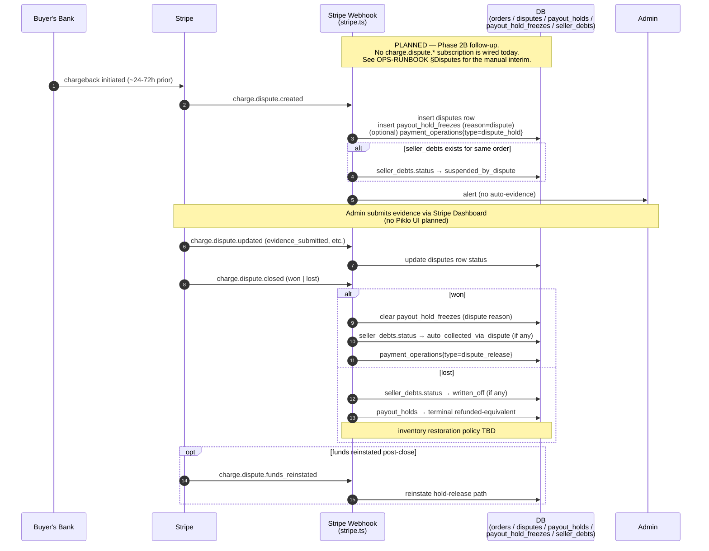

> **Provenance:** engine doc copied from `benobie/piklo-v2` @ `2419a38` at fork time (02/07/2026), with `@piklo/*` renamed `@bushpop/*`. May drift from upstream — see `docs/engine/FORK.md`.

---
last-verified: 2026-05-03
---

# Disputes and Refunds

This doc covers two related but distinct flows on the money side of Piklo:

- **Refunds** — initiated by us (a seller, an admin, or a system-driven compensation path). We own the orchestration end-to-end. Today only the single-seller (Stripe destination charge) refund pipeline is shipped.
- **Disputes** — initiated by the buyer's bank as a chargeback. We are reactive. As of `last-verified` above, no `charge.dispute_*` webhook handler is wired and there is no first-class `disputes` table; the operator handles disputes manually in the Stripe Dashboard. The first-class flow is locked in [ADR-014](DECISIONS.md#adr-014-stripe-refund-r2-design-locked--38-decisions-across-3-council-rounds-08042026) and tracked under Phase 2B follow-up.

Refunds dominate the surface area; disputes are a short reactive section pending implementation.

> **Cross-links to read alongside this doc:**
> [State Machines — Order / Payout Hold / Refund](state-machines.md) ·
> [Payment Flow — Refund Pipeline](PAYMENT-FLOW.md#refund-pipeline) ·
> [Payment Flow — Webhook Reconciliation](PAYMENT-FLOW.md#webhook-reconciliation) ·
> [Ops Runbook — Refunds](OPS-RUNBOOK.md#refunds-live--phase-2b) ·
> [Ops Runbook — Disputes](OPS-RUNBOOK.md#disputes--todo-phase-3)

---

## 1. Refund flow (LIVE)

The single canonical service is `processRefund(orderId, initiatedBy, reason, options)` in [`packages/api/src/lib/refund-service.ts`](../packages/api/src/lib/refund-service.ts). All refund paths go through it. Per [ADR-012](DECISIONS.md#adr-012-admin-cancel-folds-into-shared-refundservice-08042026), admin cancel is a thin wrapper that passes `{ isAdmin: true, terminalOrderStatus: 'cancelled' }`; it is not a separate service.

### 1.1 Who can initiate a refund

| Initiator | Entry point | `terminalOrderStatus` |
|-----------|-------------|-----------------------|
| Seller | Seller-facing API route → `processRefund(orderId, sellerId, reason)` | `refunded` |
| Admin (cancel) | `POST /api/v1/admin/orders/:id/cancel` ([`admin/orders/routes.ts`](../packages/api/src/routes/v1/admin/orders/routes.ts)) → `processRefund(..., { isAdmin: true, terminalOrderStatus: 'cancelled' })` | `cancelled` |
| System (late-success after expiry) | `handlePaymentAfterExpiry` in [`store/checkout/service.ts`](../packages/api/src/routes/v1/store/checkout/service.ts) — fires a Stripe refund directly with the independent flag rules described in §1.7 | n/a (refund-only) |

The seller is checked at the service layer (`order.sellerId === initiatedBy`) as defence in depth; the admin path passes `isAdmin: true` to bypass it. Route-level middleware should also gate.

### 1.2 Branch on `payout_holds.status`

`processRefund` selects a path based on the payout hold. Holds are created at `payment_intent.succeeded` and gate the real Stripe transfer to the seller (see [Payment Flow — Payout Hold Lifecycle](PAYMENT-FLOW.md#payout-hold-lifecycle)).

| `payout_holds.status` | Path | Stripe calls |
|------------------------|------|--------------|
| `held` | Pre-transfer | One `refunds.create` only |
| `blocked` | Pre-transfer (seller account issue) | One `refunds.create` only |
| `released` | Post-transfer | `refunds.create` THEN `transfers.createReversal` |
| anything else | Rejected (`ConflictError`) | None |

### 1.3 Pre-transfer path (`held` / `blocked`)

The seller hasn't been paid yet. The buyer's charge is on the platform balance; one `stripe.refunds.create` against the PaymentIntent returns the funds. No transfer reversal is needed. On success: `refunds.status = processed`, `orders.status` → terminal (`refunded` or `cancelled`), `payout_holds.status` → `refunded`, `restoreInventory` resets sold listings to `paused` and inventory items to `available` / `owned`.

For `blocked` holds (seller account offboarded or otherwise terminal), the state machine refuses transitions, so the path takes a direct `payout_holds.status = 'refunded'` update inside the transaction.

### 1.4 Post-transfer path (`released`) — seller-refund semantics

Seller funds have already been transferred to their connected account. We **refund first, then reverse the transfer**, so the buyer is always made whole. If the reversal fails (seller insufficient balance, account offboarded), the platform absorbs the shortfall and admin is alerted; the buyer's refund stands.

This is the **seller-initiated refund contract** (FM-9 in [ADR-013](DECISIONS.md#adr-013-stripe-refund-r1-resolution--fm-8-wal-ordering-fm-9-two-path-contract-lb-3-indeterminate_5xx-08042026)). Admin cancel post-release intentionally takes a different ordering invariant (reversal-first; fail loudly if seller can't cover) and is **not yet built**: the admin route currently 409s on `released` holds as a temporary safety net until the R2 `adminCancelPostRelease` primitive ships.

Order-level transitions:

```
orders.status: paid (or shipped/delivered) → refund_in_progress → refunded | cancelled
```

The intermediate `refund_in_progress` exists only on the post-transfer path. The terminal write is CAS-guarded on `WHERE status = 'refund_in_progress'` so an out-of-band update can't race past it.

#### FM-8 ordering rule

The reversal `payment_operations` row is created **before** the refund op is marked `succeeded`, so a crash between the two Stripe calls leaves a `pending` reversal op for `resumePendingRefunds` to pick up. Reversing this order leaves an orphan succeeded refund op and a missing reversal — that combination is unrecoverable from the WAL alone.

### 1.5 The payment-operations WAL

Every Stripe refund and reversal call is bracketed by writes to the `payment_operations` table — a write-ahead log, not a workflow engine. Helpers live in [`payment-operations.ts`](../packages/api/src/lib/payment-operations.ts).

| Helper | When called | Status transition |
|--------|-------------|-------------------|
| `createPaymentOp` | Before the Stripe call | `→ pending` |
| `succeedPaymentOp` | After Stripe returns 2xx | `pending → succeeded` (CAS) |
| `failPaymentOp` | After Stripe returns a non-5xx error | `pending → failed` (CAS) |
| `markIndeterminate5xx` | After Stripe returns 5xx / network error | `pending → indeterminate_5xx` (CAS) |
| `succeedIndeterminateOp` | Webhook reconciliation confirms the side effect landed | `indeterminate_5xx → succeeded` (CAS) |
| `succeedAutoFailedOp` | Late webhook arrives after the cron auto-failed the op | `failed (auto_timeout_unverified) → succeeded` (CAS, sets `resurrected_at`) |

The op carries `metadata.piklo_payment_op_id` into Stripe so webhook handlers and the daily reconciler can match an out-of-band Stripe event back to the WAL row.

#### Why the WAL exists

Stripe caches 5xx responses **under the original idempotency key for 24 hours** and explicitly advises against retrying with a fresh key. Two consequences:

1. The same idempotency key cannot be retried within the cache window without returning the cached 5xx (so re-issuing the original POST does not give us truth).
2. Idempotency keys are POST-only — there is no GET-by-key lookup. We cannot ask Stripe "what happened with this key?".

Recovery therefore goes via the Stripe **List API** (`stripe.refunds.list({ payment_intent })`, `stripe.transfers.listReversals(transfer_id)`), matching by `metadata.piklo_payment_op_id` to find the WAL row. That match-by-metadata is the load-bearing reason every `stripe.refunds.create` and `stripe.transfers.createReversal` site **must** pass `{ piklo_payment_op_id, piklo_order_id, piklo_refund_id }` in metadata.

#### `IndeterminateStripeError`

`classifyAndMarkStripeError` in `refund-service.ts` looks at the caught error:

- `statusCode >= 500` → `markIndeterminate5xx`, throw `IndeterminateStripeError`. Caller short-circuits — no downstream DB writes, no `refunds.status = 'failed'`, no rethrow into the failed path.
- `type === 'StripeIdempotencyError'` → `failPaymentOp` and rethrow. Cross-row collision; needs operator attention, not silent retry with a new key.
- Everything else → `failPaymentOp` and rethrow.

### 1.6 Webhook reconciliation is the primary recovery path

Once a payment op is in `indeterminate_5xx`, `resumePendingRefunds` deliberately **does not** replay it (replay would return the cached 5xx, not the truth). Reconciliation arrives via webhook. Handlers live in [`webhooks/stripe.ts`](../packages/api/src/routes/v1/webhooks/stripe.ts):

| Stripe event | Handler | Reconciler call |
|--------------|---------|-----------------|
| `refund.created` / `refund.updated` | `handleStripeRefundWebhook` | `reconcileRefundOpFromStripe(opId, refund.id)` |
| `charge.refunded` | `handleChargeRefundedWebhook` (walks `charge.refunds.data`) | `reconcileRefundOpFromStripe(opId, refund.id)` per match |
| `transfer.updated` | `handleTransferReversalWebhook` (walks `transfer.reversals.data`) | `reconcileReversalOpFromStripe(opId, reversal.id)` per match |

> **Stripe does NOT emit `transfer.reversal.created`.** Reversals surface via `transfer.updated` with a grown `reversals.data` list. ADR-013 records this; do not subscribe to a non-existent event type.

Both reconcile helpers begin their transaction with `SELECT … FROM orders WHERE id = ? FOR UPDATE`. Without this lock, the refund webhook and the reversal webhook can arrive concurrently, both read stale snapshots, both skip the order finalisation branch, and the order is stranded in `refund_in_progress` forever (`LB-R2-2` in [ADR-014](DECISIONS.md#adr-014-stripe-refund-r2-design-locked--38-decisions-across-3-council-rounds-08042026)).

A daily reconciliation worker ([`workers/reconcile-indeterminate-ops.ts`](../packages/api/src/workers/reconcile-indeterminate-ops.ts)) sweeps any ops still `indeterminate_5xx` past the grace window and matches via List API for the webhook-lost edge case.

### 1.7 `reverse_transfer` and `refund_application_fee` are INDEPENDENT

When refunding a destination charge, the two flags on `stripe.refunds.create` are **not** coupled. Coupling them is a documented bug pattern (LB-F7-REFUND-FLAGS); same-model code review tends to miss it.

- Gate `reverse_transfer` on `transfer_data.destination != null` **alone**. A destination charge with zero application fee still needs the transfer reversed — the seller received the transfer.
- Gate `refund_application_fee` on `application_fee_amount > 0` **alone**. Passing it on a charge with no application fee makes Stripe error `application_fee_not_found`.

Do not collapse them into a single `isDestinationCharge` boolean. The independent rule lives in the live recovery path at `handlePaymentAfterExpiry` ([`store/checkout/service.ts`](../packages/api/src/routes/v1/store/checkout/service.ts)) and is repeated in [AGENTS.md](../AGENTS.md) and [Ops Runbook — Refunds](OPS-RUNBOOK.md#refunds-live--phase-2b).

### 1.8 Single-seller vs multi-seller

The refund pipeline above assumes a **destination charge** — single seller, one PaymentIntent, one transfer to one connected account. This is the only refund path implemented today.

For multi-seller carts (separate charges and transfers, SC&T — locked in [ADR-015](DECISIONS.md#adr-015-multi-vendor-cart--hybrid-charge-types-12042026)) the model is per-allocation: one `transfers.createReversal` per seller allocation followed by one `refunds.create` (partial) on the parent PaymentIntent. The schema for it is in place — `allocation_refunds` in [`packages/db/src/schema/commerce.ts`](../packages/db/src/schema/commerce.ts) — but **no service-layer code calls it yet**. The fan-out worker in [`packages/api/src/workers/refund.ts`](../packages/api/src/workers/refund.ts) currently runs single-seller `processRefund` only; SC&T per-allocation work is tracked under ADR-015 W3+.

When SC&T refund lands, the platform-balance ordering matters: reversal **first** (returns funds to platform balance), refund **second** (debits the platform balance). Sequencing the other way risks platform balance exhaustion (LB-M1).

### 1.9 Crash recovery and late-webhook resurrection

`resumePendingRefunds()` runs on worker boot ([`workers/refund.ts`](../packages/api/src/workers/refund.ts)). It scans `payment_operations` for ops in `pending` older than 5 minutes and replays the Stripe call with the same idempotency key — Stripe deduplicates and returns the original outcome.

Critically, `findPendingOps` filters on `status = 'pending'` only. Ops in `indeterminate_5xx` are deliberately excluded — replaying them would return the cached 5xx for up to 24h.

A late webhook can also arrive after the daily cron has auto-failed an op (transition `pending → failed` with `failure_provenance = 'auto_timeout_unverified'`). Both reconcile helpers attempt resurrection via `succeedAutoFailedOp` on this exact provenance. The CAS predicate is intentionally narrow:

| `failure_provenance` | Resurrectable? |
|----------------------|----------------|
| `auto_timeout_unverified` | YES — cron gave up but Stripe actually processed |
| `stripe_confirmed_failed` | NO — Stripe explicitly said no |
| `operator_verified_absent` | NO — operator inspected and confirmed missing |
| `cron_retry_exhausted` (reserved) | NO |
| `idempotency_conflict` (reserved) | NO |

A successful resurrection sets `resurrected_at` for audit and enqueues an admin alert.

For the operator escape hatch (`adminForceFailOp`) and `seller_debts` accounting in the post-transfer reversal-failure case, see [ADR-014](DECISIONS.md#adr-014-stripe-refund-r2-design-locked--38-decisions-across-3-council-rounds-08042026).

---

## 2. Diagram #8 — Refund flow with reversal

```mermaid
sequenceDiagram
    autonumber
    participant Caller as Caller (seller / admin / expiry)
    participant Svc as RefundService<br/>(processRefund)
    participant WAL as payment_operations<br/>(WAL)
    participant Stripe
    participant Hook as Stripe Webhook<br/>(stripe.ts)
    participant DB as DB<br/>(orders / refunds /<br/>payout_holds / inventory)

    Caller->>Svc: processRefund(orderId, initiatedBy, reason, options)
    Svc->>DB: load order, payout_hold; gate on non-terminal payment_ops
    Svc->>DB: insert refunds row (status=pending)

    alt payout_hold = held or blocked  (pre-transfer)
        Svc->>WAL: createPaymentOp(refund) [pending]
        Svc->>Stripe: refunds.create(PI, metadata={op_id, order_id, refund_id},<br/>idempotencyKey=refund_<id>)

        alt 2xx success
            Stripe-->>Svc: refund object
            Svc->>WAL: succeedPaymentOp [succeeded]
            Svc->>DB: txn: refund→processed,<br/>order→terminal, hold→refunded,<br/>restoreInventory
        else 5xx (indeterminate)
            Stripe --x Svc: HTTP 5xx
            Svc->>WAL: markIndeterminate5xx [indeterminate_5xx]
            Note over Svc,Hook: short-circuit;<br/>NO refund-failed write,<br/>NO retry with new key (24h cache)
            Hook->>Stripe: (later) refund.created webhook
            Hook->>Svc: reconcileRefundOpFromStripe(opId, refundId)
            Svc->>DB: SELECT FOR UPDATE on orders<br/>then same finalisation block
        else other error
            Stripe --x Svc: error
            Svc->>WAL: failPaymentOp [failed]
            Svc->>DB: refund→failed, rethrow
        end

    else payout_hold = released  (post-transfer, refund-first-then-reversal)
        Svc->>DB: order→refund_in_progress (CAS)
        Svc->>WAL: createPaymentOp(refund) [pending]
        Svc->>Stripe: refunds.create(PI, metadata, idempotencyKey)

        alt refund 2xx
            Stripe-->>Svc: refund object
            Note over Svc,WAL: FM-8: pre-create reversal op<br/>BEFORE marking refund succeeded
            Svc->>WAL: createPaymentOp(reversal) [pending]
            Svc->>WAL: succeedPaymentOp(refund) [succeeded]
            Svc->>DB: refund→pending_reversal
            Svc->>Stripe: transfers.createReversal(transferId,<br/>metadata, idempotencyKey=reversal_<id>)

            alt reversal 2xx
                Stripe-->>Svc: reversal object
                Svc->>WAL: succeedPaymentOp(reversal) [succeeded]
                Svc->>DB: txn: refund→processed,<br/>order→terminal, restoreInventory
            else reversal 5xx
                Stripe --x Svc: HTTP 5xx
                Svc->>WAL: markIndeterminate5xx(reversal)
                Note over Svc,Hook: short-circuit;<br/>buyer is whole;<br/>webhook reconciles
                Hook->>Stripe: (later) transfer.updated webhook<br/>walks reversals.data
                Hook->>Svc: reconcileReversalOpFromStripe(opId, reversalId)
                Svc->>DB: SELECT FOR UPDATE on orders<br/>then finalise
            else reversal non-5xx failure
                Stripe --x Svc: error (insufficient balance, offboarded, etc.)
                Svc->>WAL: failPaymentOp(reversal) [failed]
                Note over Svc: buyer already whole;<br/>platform absorbs;<br/>admin alert; do NOT rethrow<br/>(R2: write seller_debts row)
            end

        else refund 5xx
            Svc->>WAL: markIndeterminate5xx(refund)
            Note over Svc,Hook: refund row stays pending;<br/>order stays refund_in_progress;<br/>webhook reconciles refund first,<br/>reversal still outstanding
        else refund non-5xx
            Svc->>WAL: failPaymentOp(refund) [failed]
            Svc->>DB: refund→failed
        end
    end

    Note over Svc,Hook: Independence rule (LB-F7-REFUND-FLAGS):<br/>reverse_transfer gated on transfer_data.destination != null<br/>refund_application_fee gated on application_fee_amount &gt; 0<br/>NEVER coupled into a single isDestinationCharge bool
```

---

## 3. Dispute flow (REACTIVE — partly PLANNED)

A **dispute** is a buyer-initiated chargeback at their issuing bank. Funds reverse at Stripe before any merchant action; we are reactive throughout.

### 3.1 Current shipped state

As of `last-verified` above:

- The Stripe webhook handler at [`webhooks/stripe.ts`](../packages/api/src/routes/v1/webhooks/stripe.ts) does **not** subscribe to `charge.dispute.created`, `charge.dispute.updated`, `charge.dispute.closed`, or `charge.dispute.funds_reinstated`. Any dispute received against a connected account today flows to the Stripe Dashboard and triggers no Piklo-side state change.
- There is no first-class `disputes` table in `packages/db/src/schema/`.
- `PaymentOperationType` reserves `dispute_hold` and `dispute_release` ([`packages/types/src/commerce.ts`](../packages/types/src/commerce.ts)) but no code creates either.
- `freezePayoutHold(orderId)` in [`payout-hold-service.ts`](../packages/api/src/lib/payout-hold-service.ts) sets `payout_holds.frozen_at` and is forward-compatible with the planned dispute flow, but has zero callers today.
- The interim operator procedure is in [Ops Runbook — Disputes](OPS-RUNBOOK.md#disputes--todo-phase-3): submit evidence through the Stripe Dashboard; manual SQL updates to Piklo state once the dispute closes.

### 3.2 Planned (Phase 2B follow-up)

The locked design in [ADR-014](DECISIONS.md#adr-014-stripe-refund-r2-design-locked--38-decisions-across-3-council-rounds-08042026) (FM-4, decisions #25 / #36) wires:

- **`charge.dispute.created`** → write a `payout_hold_freezes` row with `reason = 'dispute'` (multi-reason model — debt and dispute can coexist on the same hold). Insert a first-class `disputes` row. Optionally record `payment_operations { type: 'dispute_hold' }` for the WAL trail. Notify admin. No automatic evidence submission.
- **`charge.dispute.updated`** → reflect status changes on the `disputes` row.
- **`charge.dispute.closed`** → resolve the freeze and the dispute row:
  - `status: won` → freeze cleared; if there's a coexisting `seller_debts` row in `suspended_by_dispute`, resolve to `auto_collected_via_dispute`; record `payment_operations { type: 'dispute_release' }`.
  - `status: lost` → debt (if any) resolves to `written_off`; payout hold settles to a terminal refunded-equivalent state; inventory restoration policy TBD.
- **`charge.dispute.funds_reinstated`** → reinstate the standard hold-release path.

There is no Piklo-side UI for evidence submission planned; the operator continues to use the Stripe Dashboard. The diagram below captures the planned event shape, not current behaviour.

---

## 4. Diagram #9 — Dispute reaction (PLANNED)



---

## 5. Cross-references

- [State Machines — Order](state-machines.md#order) · [Payout Hold](state-machines.md#payout-hold) — terminal states reached by the refund pipeline. (B2 is rewriting `state-machines.md` in parallel; if the anchors drift, the file-level link still resolves.)
- [Payment Flow — Refund Pipeline](PAYMENT-FLOW.md#refund-pipeline) · [Webhook Reconciliation](PAYMENT-FLOW.md#webhook-reconciliation) · [WAL Pattern](PAYMENT-FLOW.md#the-wal-pattern-write-ahead-log) — money-flow context (where the funds go between Stripe, platform balance, and seller account).
- [Ops Runbook — Refunds](OPS-RUNBOOK.md#refunds-live--phase-2b) — operator procedure for issuing or reconciling a refund in production, including the SQL queries and the `indeterminate_5xx` recovery checklist.
- [Ops Runbook — Disputes](OPS-RUNBOOK.md#disputes--todo-phase-3) — manual interim procedure until the planned flow ships.
- [ADR-012](DECISIONS.md#adr-012-admin-cancel-folds-into-shared-refundservice-08042026) — admin cancel folds into `processRefund`.
- [ADR-013](DECISIONS.md#adr-013-stripe-refund-r1-resolution--fm-8-wal-ordering-fm-9-two-path-contract-lb-3-indeterminate_5xx-08042026) — FM-8 ordering, FM-9 two-path contract, LB-3 indeterminate-5xx model.
- [ADR-014](DECISIONS.md#adr-014-stripe-refund-r2-design-locked--38-decisions-across-3-council-rounds-08042026) — R2 design lock: split primitives, `seller_debts`, `cancel_requested`, `payout_hold_freezes`, dispute webhook.
- [ADR-015](DECISIONS.md#adr-015-multi-vendor-cart--hybrid-charge-types-12042026) — SC&T per-allocation refund model (scaffolded only).
- [AGENTS.md](../AGENTS.md) — Gotchas: Stripe 5xx, idempotency-key-not-GETtable, `reverse_transfer` / `refund_application_fee` independence, webhook reconciler `SELECT FOR UPDATE`.

---

## 6. Phase 2B follow-up

Sections to revisit when first-class disputes land:

- §3.1 *Current shipped state* — flip current/planned framing once `charge.dispute.*` is subscribed and a `disputes` table exists.
- §3.2 *Planned (Phase 2B follow-up)* — collapse into the new shipped narrative; keep ADR-014 references.
- §4 *Diagram #9* — drop the "PLANNED" `Note over` banner and re-render against the as-built handler.

When the SC&T per-allocation refund service ships (ADR-015 W3+):

- §1.8 *Single-seller vs multi-seller* — replace "no service-layer code calls it yet" with the actual entry points and worker fan-out shape.
- §2 *Diagram #8* — add an SC&T branch (or fork into a separate diagram) covering reversal-first-then-PI-partial-refund per-allocation.

When `adminCancelPostRelease` (R2 split primitive) ships:

- §1.4 *Post-transfer path* — add the admin-cancel ordering invariant (reversal-first, fail loudly) alongside the seller-refund one.
- Drop the "currently 409s" caveat.
