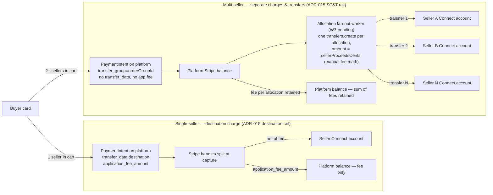
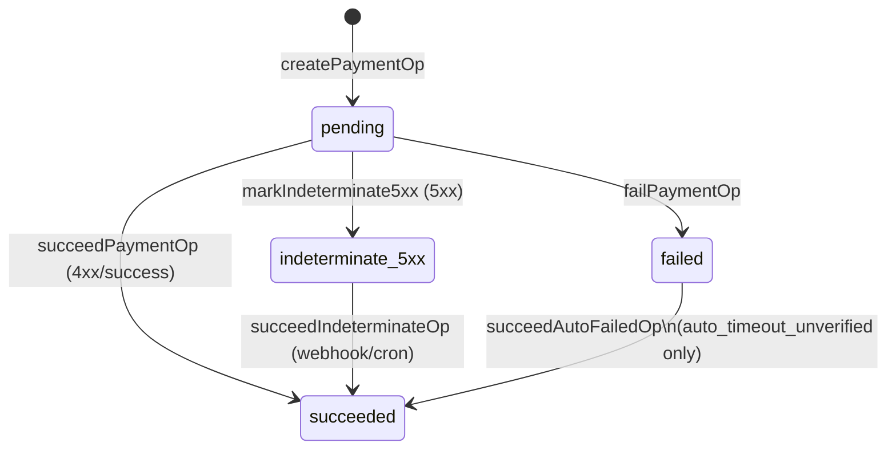
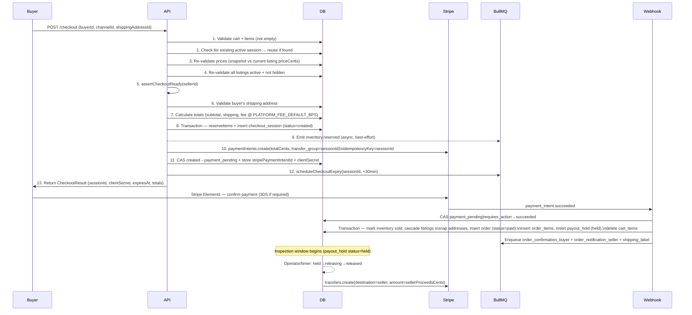

> **Provenance:** engine doc copied from `benobie/piklo-v2` @ `2419a38` at fork time (02/07/2026), with `@piklo/*` renamed `@bushpop/*`. May drift from upstream — see `docs/engine/FORK.md`.

---
last-verified: 2026-05-03
---

# Payment Flow

> How money moves through Piklo. Read this before touching checkout,
> orders, refunds, or Stripe webhooks.
>
> For system-level architecture, see [ARCHITECTURE.md](ARCHITECTURE.md).
> For the original design document, see [STRIPE-MONEY-FLOW.md](STRIPE-MONEY-FLOW.md).
> For the end-to-end checkout narrative (cart → quote → confirm → split), see [CHECKOUT-FLOW.md](CHECKOUT-FLOW.md).

---

## Stripe Connect Model

Source: `docs/DECISIONS.md` ADR-011

Piklo uses **Stripe Connect Express** with **separate charges and transfers (SC&T)**. The platform is merchant of record for every transaction.

**How funds move:**

1. Buyer's card is charged via a `PaymentIntent` on the **platform account**. No `transfer_data`, no `on_behalf_of`, no `application_fee_amount`.
2. Funds land in the **platform Stripe balance** and stay there during the inspection window.
3. On payout release, the platform calls `stripe.transfers.create({ destination: seller.stripeAccountId, amount: hold.amountCents, transfer_group: orderId })`.
4. **Platform fee is implicit:** `totalCents − transferAmountCents`. No Stripe-level application fee to reason about.



The branch is decided in [`packages/api/src/routes/v1/store/checkout-groups/service.ts`](../packages/api/src/routes/v1/store/checkout-groups/service.ts) `createQuoteAndPaymentIntent`: `chargeType = sellerIds.length === 1 ? "destination" : "sct"`. The destination rail relies on Stripe to deduct the fee and route funds at capture; the SC&T rail captures the full amount onto the platform balance and the fan-out worker creates one transfer per allocation. The fan-out worker (`packages/api/src/workers/allocation-fanout.ts`) is W3-pending — see [CHECKOUT-FLOW.md § Multi-seller SC&T path](CHECKOUT-FLOW.md#multi-seller-sct-path).

**Why not destination charges?** Destination charges move funds to the connected account immediately upon capture. That is incompatible with the inspection/payout-hold window, makes pre-transfer refunds more complex, and locks chargebacks on the seller account. SC&T lets the platform hold funds on its own balance and issue the transfer on its own schedule (ADR-011).

**ADR-015 note:** Multi-seller carts use a hybrid model. Single-seller orders use **destination charges** (already built). Multi-seller orders use **SC&T** with one `PaymentIntent` for the full cart total and async per-seller `transfers.create` after the webhook. See `docs/DECISIONS.md` ADR-015 and the `order_groups` / `order_group_seller_allocations` schema (Sprint 1b).

### Seller disclosures

**Stripe platform reserve (10–25%):** Stripe may impose a 10–25% reserve on a new fashion marketplace's platform balance, held for a defined period (typically rolling 90 days). This is a cash-flow risk for sellers — delayed payouts are possible even when the order completed cleanly on Piklo's side. Seller onboarding copy **must** communicate this so sellers understand payout timing is not solely determined by Piklo's inspection window.

---

## The WAL Pattern (Write-Ahead Log)

Source: `packages/api/src/lib/payment-operations.ts`

Every Stripe API call that has a financial side effect is wrapped in a `payment_operations` row. This provides crash recovery and reconciliation without distributed transactions.

**Three-step lifecycle:**

1. `createPaymentOp(orderId, type, idempotencyKey, amountCents)` → inserts row with `status = 'pending'`. **This happens BEFORE the Stripe call.**
2. Stripe API call is made.
3. One of three outcomes:
   - **Success** → `succeedPaymentOp(id, providerObjectId)` → `status = 'succeeded'`
   - **4xx / network error** → `failPaymentOp(id, lastError)` → `status = 'failed'`
   - **5xx** → `markIndeterminate5xx(id, lastError)` → `status = 'indeterminate_5xx'`

All three transition functions are CAS-guarded with `WHERE status = 'pending'`. A second call on an already-transitioned row returns `null` — callers treat this as a no-op.



**Additional transitions:**
- `succeedIndeterminateOp(id, providerObjectId)` — called by webhook handlers and the daily reconciler when Stripe confirms the 5xx side effect landed.
- `succeedAutoFailedOp(id, providerObjectId)` — called when a late webhook arrives for an op that was auto-marked `failed + auto_timeout_unverified` by the 72h cron. Guards against resurrecting `stripe_confirmed_failed` or `operator_verified_absent` ops.

**Op types:** `'refund'` and `'reversal'` (live). `'payment_intent_create'` deferred to Sprint 1b.

### Idempotency Contract

Source: `packages/api/src/middleware/idempotency.ts`

- **HTTP-level:** `idempotencyMiddleware` checks the `Idempotency-Key` request header (POST/PUT/PATCH only). On a match, returns the cached response with `x-idempotent-replayed: true`. Keys expire after 24 hours.
- **Checkout PI creation:** `sessionId` is used as the Stripe idempotency key. One PI per session, guaranteed.
- **Refund/reversal ops:** ULID-based keys (`refund_<refundId>`, `reversal_<refundId>`). Keys are minted once and reused on crash recovery — never rotated on 5xx.
- **Never rotate a key on 5xx.** Stripe caches the 5xx under the original key for 24h. Rotating generates a new Stripe call and risks a double side effect. The correct path is `indeterminate_5xx` → webhook reconciliation.

---

## Happy Path

Source: `packages/api/src/routes/v1/store/checkout/service.ts` (`initiateCheckout`), `packages/api/src/routes/v1/webhooks/stripe.ts` (`handlePaymentIntentSucceeded`)



**Config constants** (`packages/api/src/routes/v1/store/checkout/service.ts`):

| Constant | Value | Purpose |
|---|---|---|
| `CHECKOUT_EXPIRY_MINUTES` | `30` | Session TTL before expiry worker fires |
| `PLATFORM_FEE_DEFAULT_BPS` | `800` | 8% fallback fee if channel has no fee set |

**Shipping calc:** Multi-item shipping: highest class rate + $3.00 AUD per additional item. Implemented in `@bushpop/config/shipping` (`calculateShipping`).

**CAS pattern throughout:** Every status transition uses `WHERE id = ? AND status = ? AND version = ?`. If 0 rows are updated, a concurrent writer won and the caller raises a `ConflictError`. Versions are incremented on every write.

---

## Failure Modes

Source: `packages/api/src/routes/v1/store/checkout/service.ts`, `packages/api/src/workers/checkout-expiry.ts`, `docs/EDGE-CASES.md`

### 1. Stripe 5xx during PaymentIntent create

The checkout service catches all Stripe errors in a `try/catch` around step 10. Any throw (5xx or otherwise) triggers cleanup:

```
Stripe throws → session status = 'failed' + releaseItems(inventoryItemIds)
```

The `sessionId` idempotency key remains live on Stripe's side for 24h. If the client retries, they will receive the cached 5xx until the key expires, after which a fresh `initiateCheckout` call mints a new session.

Note: WAL ops are not used for the initial PI creation in the current implementation. `payment_intent_create` op type is deferred to Sprint 1b (LB-F8-WAL Part 2).

### 2. 3DS required (requires_action state)

`payment_intent.requires_action` webhook transitions `payment_pending → requires_action`. The session stays in `requires_action` until:
- Buyer completes 3DS → `payment_intent.succeeded` → order created.
- Buyer abandons or 30-minute expiry fires → `expireCheckoutSession` CAS-transitions to `expired` (if still in `CHECKOUT_ACTIVE_STATUSES`).

`cancelCheckoutSession` is **not allowed** from `requires_action`. Only `created` and `payment_pending` are cancellable by the buyer.

### 3. Late payment after session expiry

If `payment_intent.succeeded` arrives for an `expired` session, the webhook calls `handlePaymentAfterExpiry(sessionId, paymentIntentId)`:

- Re-checks inventory availability for all items.
- If all available: attempts `reserveItems` re-reservation → `"reactivated"` (falls through to order creation).
- If any item unavailable or re-reservation fails: issues `stripe.refunds.create` with flags computed independently:
  - `reverse_transfer: true` only if `charge.transfer_data.destination != null`
  - `refund_application_fee: true` only if `charge.application_fee_amount > 0`
  - Session transitions to `refunded_after_expiry`.

These flags must **not** be coupled. See `EDGE-CASES.md` §"`reverse_transfer` and `refund_application_fee` are independent flags" (LB-F7).

### 4. Expiry worker safety net

`startCheckoutExpiryWorker` runs a `setInterval` every 5 minutes alongside the BullMQ delayed-job path. The interval queries for sessions past `expiresAt` still in `CHECKOUT_ACTIVE_STATUSES` and calls `expireCheckoutSession` on each. This catches sessions missed by a crashed worker or Redis restart. `expireCheckoutSession` is idempotent via CAS — 0 rows updated = already handled.

### 5. Seller unavailable mid-checkout

`assertCheckoutReady(sellerId)` is called at step 5 before any DB writes. If the seller account is not ready (Connect account missing, `charges_enabled = false`, etc.), the checkout is rejected before inventory is reserved. No cleanup required.

### 6. Price drift (stale quote)

Step 3 compares `cartItem.priceCents` (snapshot at add-to-cart) against `channelListing.priceCents` (current). Any mismatch throws `ValidationError` before reservation. The error message instructs the buyer to remove and re-add the item. There is no silent `expectedTotalCents` defence at the PI level in the current implementation — that is tracked under a future `409 CHECKOUT_STALE` improvement.

---

## Refund Pipeline

Source: `packages/api/src/lib/refund-service.ts` (`processRefund`), `docs/DECISIONS.md` ADR-012, ADR-013

All refunds go through `processRefund(orderId, initiatedBy, reason, options)`. Admin cancellations are a thin wrapper passing `{ isAdmin: true, terminalOrderStatus: 'cancelled' }`.

### Pre-transfer (payout_hold.status = 'held' or 'blocked')

No transfer has been issued yet — the platform balance covers the full refund.

```
1. createPaymentOp → pending (type='refund', key='refund_<refundId>')
2. stripe.refunds.create({ payment_intent })
3. succeedPaymentOp → succeeded
4. DB transaction:
   - refunds row → 'processed'
   - order → terminalOrderStatus (refunded / cancelled)
   - payout_hold → 'refunded'
   - restoreInventory (listing back to active)
```

On 5xx from Stripe: `markIndeterminate5xx` → webhook or cron reconciles via `reconcileRefundOpFromStripe`.

### Post-transfer (payout_hold.status = 'released')

Seller has already received funds. Invariant: **buyer is always made whole first**.

```
1. order → 'refund_in_progress'
2. createPaymentOp → pending (type='refund', key='refund_<refundId>')
3. stripe.refunds.create({ payment_intent }) → buyer credited
4. [FM-8] createPaymentOp → pending (type='reversal', key='reversal_<refundId>')
   (pre-created BEFORE marking refund op succeeded — crash-safe ordering)
5. succeedPaymentOp(refundOp) → succeeded
6. refunds row → 'pending_reversal'
7. stripe.transfers.createReversal(order.stripeTransferId)
8. succeedPaymentOp(reversalOp) → succeeded
9. DB transaction:
   - refunds row → 'processed'
   - order CAS refund_in_progress → terminalOrderStatus
   - restoreInventory
```

**Reversal failure:** If step 7 fails with a non-5xx (seller insufficient balance, offboarded, etc.): buyer refund is already complete, admin alert is enqueued, function returns without rethrowing. Platform absorbs the shortfall. R2 will persist this as a `seller_debts` row.

### Post-transfer: admin cancel (R2 — not yet built)

Invariant: **seller is made short before buyer is made whole**. This is the opposite ordering.

1. `stripe.transfers.createReversal` first. On failure → 502, do NOT proceed to refund.
2. `stripe.refunds.create` — buyer credited.

Currently, `POST /api/v1/admin/orders/:id/cancel` returns 409 for released payout holds as a safety net. Full implementation is R2 (ADR-014). See `STRIPE-MONEY-FLOW.md` §"Admin cancel (post-release)".

### Double-refund guard

Before creating a new refund, `processRefund` checks `payment_operations` for any existing row against the same `stripePaymentIntentId` with `status IN ('pending', 'indeterminate_5xx')` OR `(status = 'failed' AND failureProvenance = 'auto_timeout_unverified')`. Any match raises a `ConflictError` — resolve via `adminForceFailOp` first.

---

## Webhook Reconciliation

Source: `packages/api/src/routes/v1/webhooks/stripe.ts`, `packages/api/src/workers/reconcile-indeterminate-ops.ts`

### Event-driven (primary)

All webhooks are signature-verified and dedup-gated (`isWebhookProcessed` / `markWebhookProcessed`). Failures dead-letter to `deadLetterWebhook`.

| Event | Handler | What it does |
|---|---|---|
| `payment_intent.succeeded` | `handlePaymentIntentSucceeded` | CAS session → succeeded; create order, payout_hold, order_items; delete cart_items; enqueue jobs. Handles payment-after-expiry compensation. |
| `payment_intent.requires_action` | `handlePaymentIntentRequiresAction` | CAS `payment_pending → requires_action` |
| `payment_intent.payment_failed` | `handlePaymentIntentFailed` | CAS `payment_pending|requires_action → failed`; release inventory reservations |
| `account.updated` | `syncAccountFromWebhook` | Sync `charges_enabled`, `payouts_enabled`, `details_submitted` to `seller_profiles` |
| `refund.created` / `refund.updated` | `handleStripeRefundWebhook` | Read `metadata.piklo_payment_op_id`; call `reconcileRefundOpFromStripe` |
| `charge.refunded` | `handleChargeRefundedWebhook` | Walk `charge.refunds.data`; reconcile each Piklo op |
| `transfer.updated` | `handleTransferReversalWebhook` | Walk `transfer.reversals.data`; call `reconcileReversalOpFromStripe` per op |

**No `transfer.reversal.created` event exists.** Reversals surface via `transfer.updated`. See `EDGE-CASES.md`.

**Webhook handlers serialise on the orders row.** Both `reconcileRefundOpFromStripe` and `reconcileReversalOpFromStripe` open their transaction with `SELECT ... FOR UPDATE` on the orders row to prevent race conditions when refund and reversal webhooks arrive in parallel.

### Cron fallback (secondary)

`reconcileIndeterminateOps` runs every 15 minutes via BullMQ (`scheduleReconcileIndeterminateOps`, `startReconcileIndeterminateOpsWorker`, cron `*/15 * * * *`, tz `Australia/Sydney`).

For each op stuck in `indeterminate_5xx` older than the grace period (default `DEFAULT_GRACE_MINUTES = 60`):

- **type = 'refund':** `stripe.refunds.list({ payment_intent })` → match `metadata.piklo_payment_op_id` → `reconcileRefundOpFromStripe`.
- **type = 'reversal':** `stripe.transfers.retrieve(transferId, { expand: ['reversals'] })` → match metadata → `reconcileReversalOpFromStripe`.
- **Not found after `STRIPE_IDEMPOTENCY_TTL_HOURS = 24`:** logged as operator escalation (TODO: R2 ops console task creation).

The reconciler uses the **List API**, not idempotency-key lookup. Idempotency keys are POST dedup — there is no GET-by-key on Stripe's API.

---

## Payout Hold Lifecycle

Source: `packages/api/src/lib/commerce-machines.ts` (`PAYOUT_HOLD_MACHINE`), `packages/api/src/lib/payout-hold-service.ts`

The `payout_holds` table gates the real Stripe transfer. Every transition is CAS-guarded via `transitionPayoutHold`.

> Canonical state machine: see [`state-machines.md#payout-hold`](state-machines.md#payout-hold).

`blocked` holds cannot be released — the seller account is not ready. `processRefund` handles `blocked` with a direct DB update (bypasses the state machine) since `blocked` has no outbound transitions defined in `PAYOUT_HOLD_MACHINE`.

---

## Config Values

| Constant | Value | File |
|---|---|---|
| `CHECKOUT_EXPIRY_MINUTES` | `30` | `checkout/service.ts` |
| `PLATFORM_FEE_DEFAULT_BPS` | `800` (8%) | `checkout/service.ts` |
| `DEFAULT_GRACE_MINUTES` | `60` | `reconcile-indeterminate-ops.ts` |
| `STRIPE_IDEMPOTENCY_TTL_HOURS` | `24` | `reconcile-indeterminate-ops.ts` |
| `RECONCILIATION_INTERVAL_MS` | `300_000` (5 min) | `checkout-expiry.ts` |
| Reconcile cron pattern | `*/15 * * * *` | `reconcile-indeterminate-ops.ts` |
| Reconcile cron tz | `Australia/Sydney` | `reconcile-indeterminate-ops.ts` |

---

## Open Items (R2)

- **Admin cancel post-release** — `POST /api/v1/admin/orders/:id/cancel` returns 409 for released holds. Full reversal-first-then-refund implementation is R2 (ADR-014).
- **`seller_debts` table** — reversal failures currently only send an admin alert email. R2 persists these as `seller_debts` rows for automated collection and reporting.
- **Operator escalation on 24h+ stuck ops** — `reconcileIndeterminateOps` logs a `console.error` but does not create an ops-console task. R2 wires this to the ops console (LB-2).
- **`payment_intent_create` WAL op type** — Sprint 1b (LB-F8-WAL Part 2). Current PI creation has no WAL row; crash during step 10 of checkout is recovered by session cleanup.
- **Multi-seller cart (`order_groups`)** — ADR-015 design locked. `checkout_sessions` table is superseded by `order_groups` for multi-seller flows. Estimated 6 weeks. Requires lawyer review before go-live (AU regulatory, Stripe AFSL #517024).
- **Dispute freeze webhook** — `charge.dispute.created` → freeze `payout_hold` via `payout_hold_freezes` table. Phase 2B follow-up. R2.
- **Transfer failed webhook** — `transfer.failed` → revert `payout_hold releasing → held`. Defensively handled in worker; webhook handler is R2.
- **FM-6 split** — `preTransferRefund` / `postTransferRefund` primitives replacing the current unified `processRefund` with an option bag. R2.

### Compliance posture — locked 19/04/2026

- **AML/CTF Tranche 2 applicability:** provisional s63A(4) Part 5 incidental-transfer posture with binding operational controls; written solicitor opinion is the authoritative supersession source. See [DECISIONS.md § ADR-018](DECISIONS.md).
- **Stripe cross-border seller support:** launch constraint — AU-only sellers. NZ / UK / other-region seller support is deferred pending Stripe Connect country-capability confirmation and any AML/CTF re-review triggered by cross-border fund flow (see ADR-018 re-review triggers).
- **Stripe reserve disclosure to sellers:** pre-Connect block + payout-email reinforcement. See [DECISIONS.md § ADR-017](DECISIONS.md).

---

*See also: [EDGE-CASES.md](EDGE-CASES.md) for Stripe gotchas, [DECISIONS.md](DECISIONS.md) for ADR-011/012/013/014/015.*
