> **Provenance:** engine doc copied from `benobie/piklo-v2` @ `2419a38` at fork time (02/07/2026), with `@bushpop/*` renamed `@bushpop/*`. May drift from upstream — see `docs/engine/FORK.md`.

---
last-verified: 2026-05-03
---

# State Machines

Single source of truth for every status field in the marketplace. The values
and edges below are taken from the shared machines under
`packages/api/src/lib/*-machines.ts` and the route services / webhook /
worker handlers that mutate them. When this doc and the code disagree, the
code wins — open an issue or follow-up PR rather than editing around it.

| Entity | Field | Anchor |
|---|---|---|
| Listing | `channel_listings.status` | [#listing](#listing) |
| Inventory item — lifecycle | `inventory_items.lifecycle_state` | [#lifecycle](#lifecycle) |
| Inventory item — availability | `inventory_items.availability_status` | [#availability](#availability) |
| Inventory item — AI enrichment | `inventory_items.ai_status` | [#ai-enrichment-status](#ai-enrichment-status) |
| Order group (multi-vendor checkout) | `order_groups.status` | [#order-group](#order-group) |
| Per-seller allocation | `order_group_seller_allocations.status` | [#per-seller-allocation](#per-seller-allocation) |
| Refund (whole-order and per-allocation) | `refunds.status`, `allocation_refunds.status` | [#refund](#refund) |
| Order | `orders.status` | [#order](#order) |
| Payout hold | `payout_holds.status` | [#payout-hold](#payout-hold) |
| Image | `inventory_item_images.status` | [#image](#image) |
| Listing report | `listing_reports.status` | [#listing-report](#listing-report) |

The legacy single-seller checkout machine has been retired in favour of
[Order Group](#order-group) per ADR-015 — see
[#legacy-checkout-session-removed](#legacy-checkout-session-removed) for the
deprecation note.

## Listing

`channel_listings.status` (`packages/db/src/schema/listings.ts`).

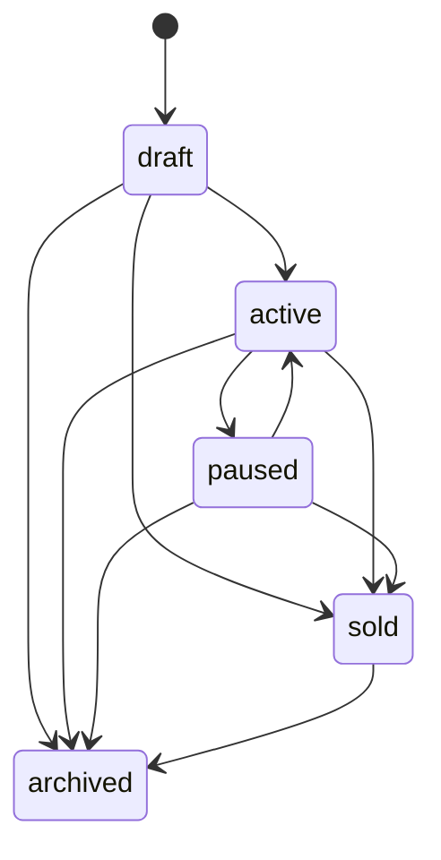

User-triggered transitions:
- `POST /api/v1/seller/listings` creates `draft`.
- `PATCH /api/v1/seller/listings/:id/status` allows `draft -> active`, `active -> paused`, `active -> sold`, `active -> archived`, `paused -> active`, `paused -> archived`, and `sold -> archived`.
- `PATCH /api/v1/seller/listings/:id/archive` archives any non-archived listing that the shared machine allows.

System-triggered transitions:
- `cascadeLifecycleToListings(itemId, "owned" | "inventory_only")` pauses active listings.
- `cascadeLifecycleToListings(itemId, "archived")` archives all non-archived listings for the item.
- `cascadeImageDeletionToListings()` pauses active listings when an item no longer has any `ready` images.

Webhook-triggered transitions:
- Stripe `payment_intent.succeeded` marks inventory items sold, then `cascadeLifecycleToListings(itemId, "sold")` marks related `draft`, `active`, and `paused` listings as `sold`.

Guards:
- Activation to `active` calls `assertListingActivationReady()`, `ensureItemListable()`, and `ensureItemHasReadyImage()`.
- First activation sets `publishedAt`; later re-activations keep the original value.
- Seller writes use optimistic version checks on `channel_listings.version`.

## Inventory Item

The table carries three separate status-like fields: `lifecycleState`, `availabilityStatus`, and `aiStatus`. Each is its own machine.

### Lifecycle

`inventory_items.lifecycle_state`.

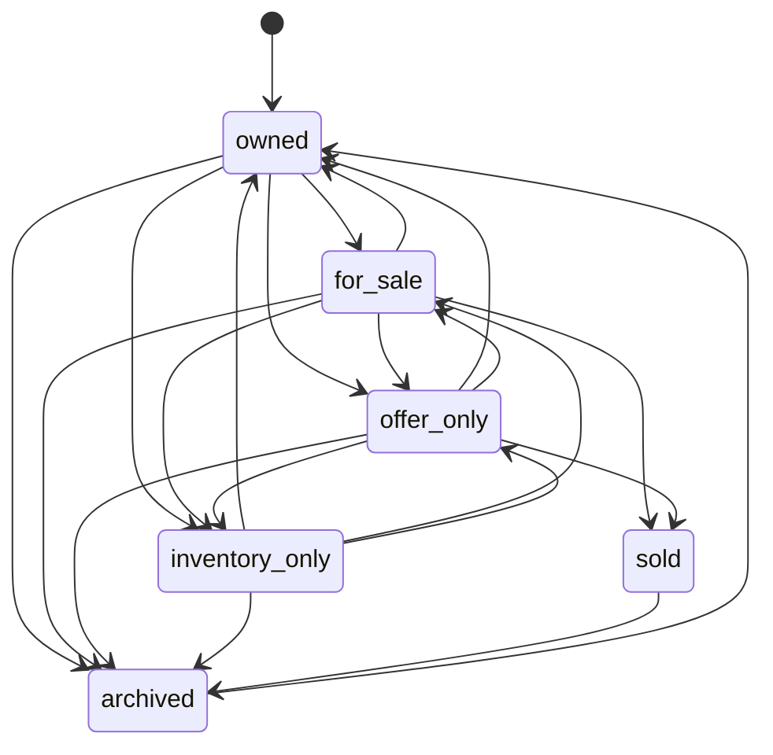

User-triggered transitions:
- `POST /api/v1/seller/inventory` creates items in `owned`.
- `PATCH /api/v1/seller/inventory/:id/lifecycle` enforces the shared lifecycle machine above.
- `PATCH /api/v1/seller/inventory/:id/archive` moves any non-archived, non-reserved item to `archived`.

Webhook-triggered transitions:
- Stripe `payment_intent.succeeded` writes `lifecycleState = "sold"` during order creation.

Guards:
- Seller lifecycle writes use optimistic version checks on `inventory_items.version`.
- Archiving is blocked when `availabilityStatus = "reserved"`.
- Lifecycle changes call `cascadeLifecycleToListings()` inside the same transaction.

### Availability

`inventory_items.availability_status`.

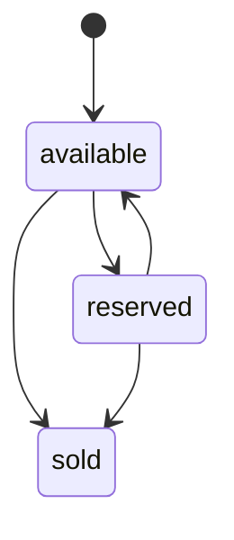

System-triggered transitions:
- `reserveItems()` sets `available -> reserved` during checkout initiation (legacy single-seller path AND the new `order_groups` path).
- `releaseItems()` sets `reserved -> available` on buyer cancel, checkout expiry, and Stripe payment failure cleanup.

Webhook-triggered transitions:
- Stripe `payment_intent.succeeded` sets reserved checkout inventory to `sold` while creating the order.

Notes:
- `available -> sold` exists in `AVAILABILITY_MACHINE`, but the current happy-path checkout flow reserves items first, so production orders normally take `available -> reserved -> sold`.
- The refund-service `restoreInventory()` helper resets `sold -> available` (and `lifecycleState sold -> owned`) when a refund completes, restoring sellable inventory.

### AI enrichment status

`inventory_items.ai_status`.

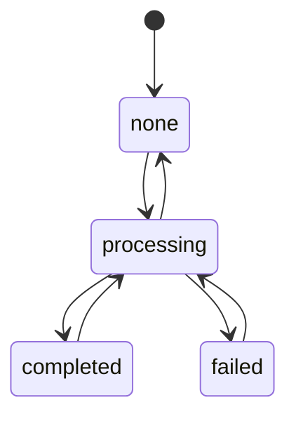

System-triggered transitions:
- `confirmUpload()` enqueues the `image-variants` worker unconditionally (Phase 1, PR #27). The old auto-enrichment enqueue is disabled — AI drafts run on demand via `POST /api/v1/seller/drafts/:id/ai-draft`.
- `processEnrichmentJob()` sets `aiStatus = "processing"` when work begins.
- Successful enrichment sets `processing -> completed`.
- Errors set `processing -> failed`.
- If the ready-image hash changed during processing, the worker sets `processing -> none` and re-enqueues the job.

Guards:
- The enrichment worker skips archived and sold items.
- The worker also no-ops when no `ready` images exist.

## Order Group

`order_groups.status`. Defined in `ORDER_GROUP_MACHINE`
([`packages/api/src/lib/commerce-machines.ts`](../packages/api/src/lib/commerce-machines.ts)).
The multi-vendor checkout anchor introduced by ADR-015 Sprint 1b. Replaces
the legacy single-seller checkout machine; one group holds the entire
checkout regardless of how many sellers it spans, with per-seller slicing
in [`#per-seller-allocation`](#per-seller-allocation).

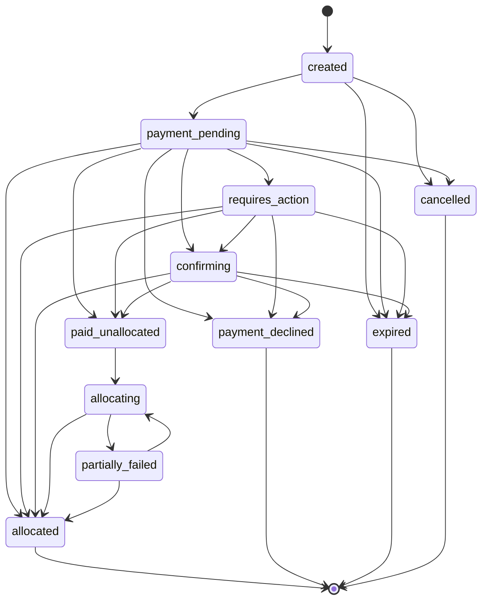

User-triggered transitions:
- `POST /api/v1/store/checkout-groups` ([`routes.ts`](../packages/api/src/routes/v1/store/checkout-groups/routes.ts), [`service.ts createQuoteAndPaymentIntent`](../packages/api/src/routes/v1/store/checkout-groups/service.ts)) inserts `created`, then CASes to `payment_pending` after Stripe PaymentIntent creation succeeds.
- `POST /api/v1/store/checkout-groups/:id/cancel` (same files, `cancelCheckoutGroup`) CASes `created | payment_pending -> cancelled`. Cancellation is rejected from any other state (the buyer cannot pull a 3DS challenge or post-payment flow back).

System-triggered transitions:
- Stripe webhook drives `payment_pending -> requires_action | confirming | paid_unallocated | allocated | payment_declined` on `payment_intent.{requires_action,succeeded,failed}`.
- The expiry worker (LB-F10, `order_groups.status, expires_at`) sweeps `created | payment_pending | requires_action | confirming -> expired` after the grace cap.
- Stripe 4xx during PI creation transitions `created -> expired` and releases reserved inventory ([`service.ts:507-530`](../packages/api/src/routes/v1/store/checkout-groups/service.ts)).
- Stripe 5xx during PI creation does NOT advance status; instead the WAL row is marked `indeterminate_5xx` and `has_pending_reconciliation = true` is set on the group. The reconciler then drives the terminal transition once Stripe confirms the side effect.
- The allocation worker drives the post-payment fan-out for SC&T groups: `paid_unallocated -> allocating -> allocated`, with `allocating -> partially_failed` if any allocation transfer is blocked. Admin retry routes `partially_failed -> allocating -> allocated`.

Charge-type branch:
- `chargeType = "destination"` (1 seller) — Stripe routes funds to the seller via `transfer_data.destination` at capture time. The group skips `paid_unallocated` and `allocating` entirely and lands directly in `allocated` once payment confirms.
- `chargeType = "sct"` (2+ sellers) — Stripe captures the full amount onto the platform account. The group goes through `paid_unallocated -> allocating -> allocated`, with per-allocation transfers grouped under `stripeTransferGroup` for atomic reversal.

Guards / invariants:
- Partial unique index `order_groups_cart_active_unique` on `(cart_id) WHERE status IN (created, payment_pending, requires_action, confirming)` enforces at most one active group per cart. Definition list in `ORDER_GROUP_ACTIVE_STATUSES`.
- `quote_hash` (sha256 over the canonical sorted allocations + per-seller subtotals) anchors the LB-M1 conservation check between quote time and capture time.
- Every status transition is CAS-guarded via the `version` column; concurrent writers receive a 409.

Terminal states: `allocated`, `payment_declined`, `expired`, `cancelled`.

Declared-but-not-yet-wired: `partially_failed` is reachable in the machine and the schema, but the admin retry surface that drives `partially_failed -> allocating | allocated` lands with the W3 backend cohort. Until then, hitting that state requires manual recovery.

## Per-Seller Allocation

`order_group_seller_allocations.status`. Defined in
`SELLER_ALLOCATION_MACHINE` ([`commerce-machines.ts`](../packages/api/src/lib/commerce-machines.ts)).
One allocation per `(order_group, seller)`. Carries the seller's slice of
the group's total and tracks the Stripe transfer (SC&T) or destination
attribution (destination charge) end-to-end.

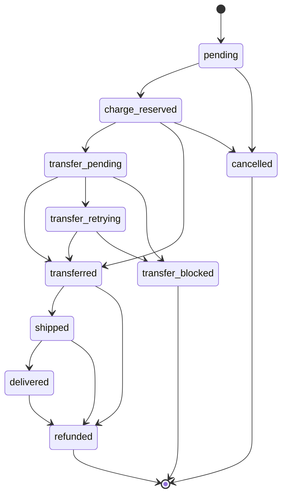

State summary:
- `pending` — initial. Inserted by `createQuoteAndPaymentIntent` alongside the parent group.
- `charge_reserved` — group's payment captured; seller's slice locked but transfer not yet initiated.
- `transfer_pending` — SC&T transfer call in flight (or about to be retried).
- `transfer_retrying` — transient transfer failure; eligible for the next retry sweep.
- `transferred` — funds reached the seller's connected account. Destination-charge allocations skip `transfer_pending`/`transfer_retrying` and land here directly.
- `shipped` / `delivered` — mirrors the parent order's lifecycle once the corresponding `orders` row is created from the allocation (W4).
- `refunded` — terminal; the allocation has been reversed via `allocation_refunds` (whole-allocation or per-item).
- `transfer_blocked` — terminal; the seller's connected account refused the transfer and admin must intervene.
- `cancelled` — terminal; the group was cancelled before payment captured.

Naming note: the original ADR-015 sketch used `pending → releasing → released` for this machine. The implementation expanded that into the richer set above so the per-attempt observability matches the WAL pattern. The word "release" remains owned by `payout_holds` for the buyer-protection hold lifecycle (see [#payout-hold](#payout-hold)) — allocations fold the actual transfer-released state into `transferred`.

Terminal states: `transfer_blocked`, `refunded`, `cancelled`.

## Refund

Two tables share the same status set: `refunds.status` (whole-order refunds for
single-seller orders) and `allocation_refunds.status` (per-allocation, with an
optional `allocation_item_id` for item-level refunds). Both follow:

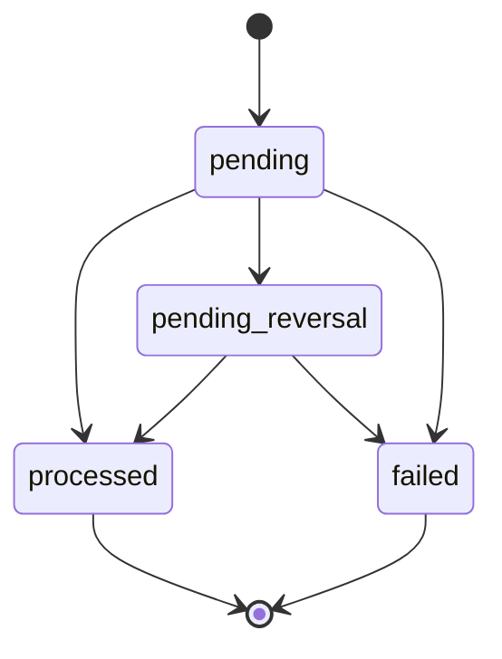

Two execution paths in [`packages/api/src/lib/refund-service.ts`](../packages/api/src/lib/refund-service.ts):

- **Pre-transfer path** (hold = `held` or `blocked`): refund the buyer's card directly. No transfer reversal needed because Stripe never moved money out of the platform balance. Sequence: insert refund as `pending`, call `stripe.refunds.create`, on success transition `pending -> processed` inside the same transaction that flips the order to `refunded`/`cancelled` and the payout hold to `refunded`.
- **Post-transfer path** (hold = `released`): refund first, then reverse the seller transfer. Sequence: insert refund as `pending`, call `stripe.refunds.create`, transition `pending -> pending_reversal`, call `stripe.transfers.createReversal`, on success transition `pending_reversal -> processed`. The buyer is always made whole; reversal failures are absorbed by the platform and surface as an admin alert until R2's `seller_debts` table.

Stripe error semantics:
- 5xx → `IndeterminateStripeError` is thrown; the refund row stays at `pending` or `pending_reversal` and the WAL op is marked `indeterminate_5xx`. The webhook (`reconcileRefundOpFromStripe` / `reconcileReversalOpFromStripe`) finalises the row out-of-band when Stripe re-confirms the side effect. Same-key replay is unsafe (Stripe caches the 5xx for 24h), so resumption uses the List API plus `metadata.piklo_payment_op_id`.
- 4xx → `pending -> failed` (or `pending_reversal -> failed`). Buyer is informed; admin must reconcile.

Concurrency guard: both reconcile helpers begin their transaction with `SELECT … FROM orders WHERE id = ? FOR UPDATE` (LB-R2-2) so the refund and reversal webhooks can arrive concurrently without leaving the order stuck in `refund_in_progress`.

Partial unique indexes (declared in [`commerce.ts`](../packages/db/src/schema/commerce.ts) header comments, applied as raw SQL in the migration):
- `refunds_order_active_unique` on `(order_id) WHERE status IN ('pending', 'pending_reversal', 'processed')` — at most one active refund per order.
- `allocation_refunds_item_active_unique` on `(allocation_item_id) WHERE allocation_item_id IS NOT NULL AND status IN ('pending', 'pending_reversal', 'processed')` — at most one active item-scoped refund per allocation item.
- `allocation_refunds_allocation_full_active_unique` on `(allocation_id) WHERE allocation_item_id IS NULL AND status IN (...)` — at most one active whole-allocation refund.

Terminal states: `processed`, `failed`. Inserts always start at `pending`.

## Order

`orders.status`. Defined in `ORDER_STATUS_MACHINE`
([`commerce-machines.ts`](../packages/api/src/lib/commerce-machines.ts)).

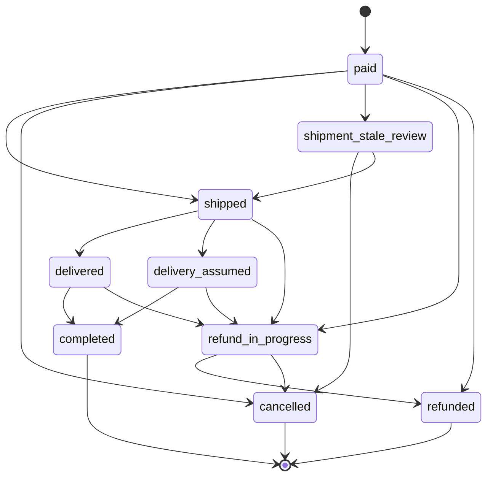

User-triggered transitions:
- `PATCH /api/v1/seller/orders/:id/ship` writes `paid -> shipped`.
- `POST /api/v1/admin/orders/:id/cancel` writes `paid -> cancelled` for the simple admin path; full reversal flows route via `processRefund` with `terminalOrderStatus = "cancelled"` (`paid | shipped | delivered -> refund_in_progress -> cancelled`).
- `processRefund` for seller-initiated refunds writes `paid | shipped | delivered -> refund_in_progress -> refunded`.

System-triggered transitions:
- Stripe `payment_intent.succeeded` creates new orders directly in `paid`.
- Starshipit webhook writes `shipped -> delivered` when the incoming status is `Delivered` / `delivered`.
- Refund webhooks reconcile `refund_in_progress -> refunded` once both the refund and (post-transfer) reversal land.

Declared-but-not-yet-wired states (present in `ORDER_STATUS_MACHINE`, awaiting workers from Phase 2B / W3):
- `delivery_assumed` — auto-complete fallback for tracked orders past the SLA window.
- `shipment_stale_review` — paused state for orders with no tracking scan past the SLA window; admin reviews before reverting to `shipped` or `cancelled`.
- `completed` — terminal once the buyer-confirm or auto-complete window elapses; nothing currently writes it.

Terminal states: `completed`, `cancelled`, `refunded`.

## Payout Hold

`payout_holds.status`. Defined in `PAYOUT_HOLD_MACHINE`
([`commerce-machines.ts`](../packages/api/src/lib/commerce-machines.ts)).
Every transition runs through `transitionPayoutHold` in
[`payout-hold-service.ts`](../packages/api/src/lib/payout-hold-service.ts)
which combines machine validation with optimistic-version CAS.

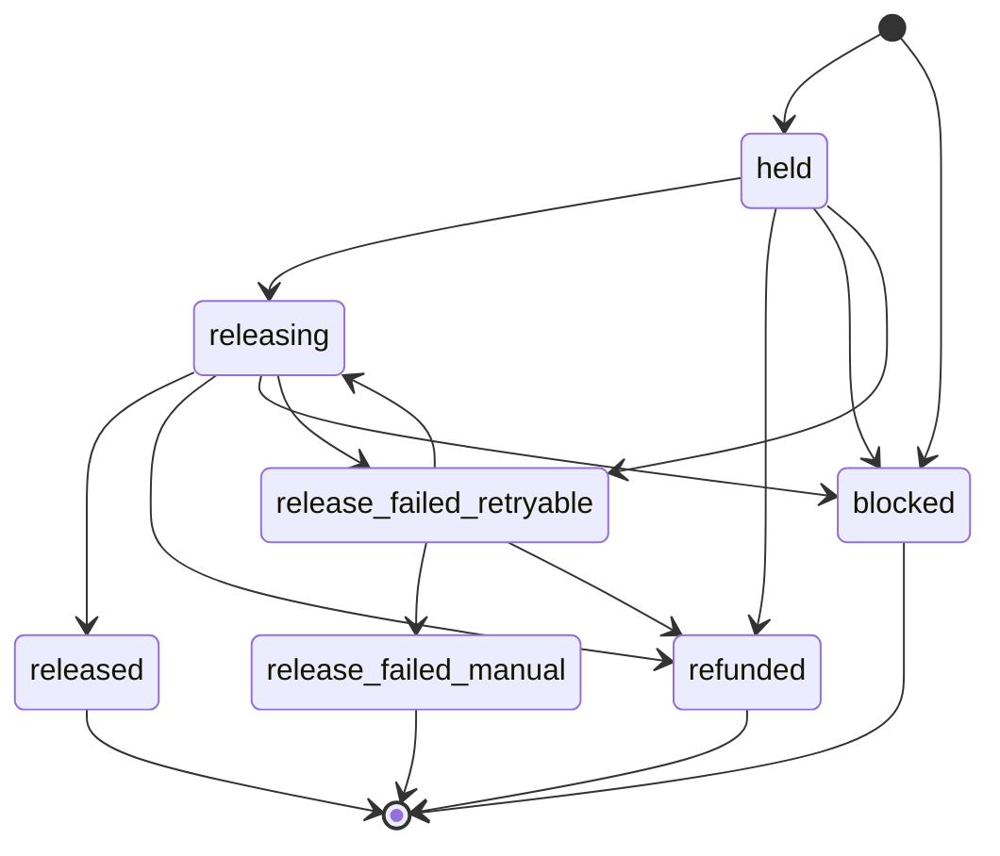

Initial states (`payment_intent.succeeded` webhook):
- `held` when the seller has a Stripe account and `stripeChargesEnabled = true`.
- `blocked` when there is no Stripe account or `stripeChargesEnabled = false`.

User-triggered transitions:
- `POST /api/v1/admin/payouts/:holdId/release` walks `held -> releasing -> released`. Pre-flight seller readiness checks can short-circuit `held -> blocked`.
- `POST /api/v1/admin/orders/:id/cancel` and `processRefund` write `held -> refunded` for pre-transfer refunds.

System-triggered transitions:
- Transfer failure during admin release rolls back `releasing -> held`.
- Retry sweep (Phase 2B) walks `held | releasing -> release_failed_retryable -> releasing -> released | release_failed_manual` based on the `transferAttempts` counter.

Hold policy (`evaluateHoldPolicy`, [`payout-hold-service.ts:152`](../packages/api/src/lib/payout-hold-service.ts)) determines `releaseEligibleAt` rather than the status itself:

| Tier | Trigger | `releaseEligibleAt` |
|---|---|---|
| `buyer_confirmed` | Buyer explicitly confirmed receipt | Immediately |
| `new_seller_7d` | Seller profile <30d old OR <5 completed orders | Delivery + 7 calendar days |
| `tracked_3d` | `shippingLabelId` or `trackingNumber` present | Delivery + 3 calendar days |
| `untracked_10bd` | No tracking data | Delivery + 14 calendar days (≈10 business days) |

Freeze gate: `freezePayoutHold` sets `frozen_at` (idempotent) without changing status. Step 7 release sweeps exclude frozen rows. Called from refund and dispute paths to prevent a transfer landing while a clawback is pending.

Cash reserve: `getCashReserveThreshold()` returns `max($500, 2× highest order total in the last 30 days)`. The release scheduler skips a payout when `availableBalance - proposedPayout < threshold`.

Terminal states: `released`, `refunded`, `blocked`, `release_failed_manual`.

Declared-but-not-yet-fully-wired: `release_failed_retryable` and `release_failed_manual` exist in the machine and schema, with the retry index `payout_holds_retry_idx` already present. The retry sweep worker that drives the loop is part of the Phase 2B / W3 cohort.

ADR-017 (Stripe reserve disclosure) does not introduce a new explicit hold state today. The reserve check sits in seller onboarding and the payout email template; whether to surface it as a distinct hold state is an open item.

## Image

`inventory_item_images.status`.

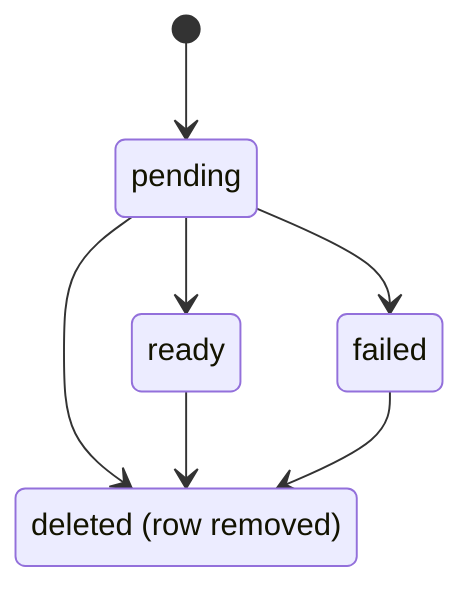

User-triggered transitions:
- `POST /api/v1/seller/inventory/:id/images/upload-url` inserts `pending`.
- `POST /api/v1/seller/inventory/:id/images/:imageId/confirm` writes `pending -> ready` when the object exists in R2.
- The same confirm route writes `pending -> failed` when the object is missing.
- `DELETE /api/v1/seller/inventory/:id/images/:imageId` removes the row from any current status.

System-triggered transitions:
- `startImageCleanupWorker()` schedules hourly cleanup that removes:
  - `pending` rows older than one hour.
  - all `failed` rows.

Guards:
- Upload URL requests are blocked for archived inventory items.
- Upload URL requests allow only JPEG, PNG, and WebP content types.
- Upload URL requests enforce a maximum of 10 non-failed images per item.
- Confirmation only accepts images still in `pending`.
- Confirming an image as primary clears any existing primary image for the item.

## Listing Report

`listing_reports.status`. Defined in `REPORT_STATUS_MACHINE`
([`packages/api/src/lib/report-machines.ts`](../packages/api/src/lib/report-machines.ts)).

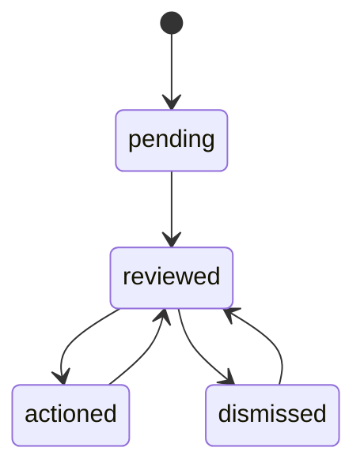

Transitions:
- `pending -> reviewed` — admin has reviewed the report.
- `reviewed -> actioned` — listing is hidden / acted upon.
- `reviewed -> dismissed` — report rejected.
- `actioned -> reviewed` — reinstatement (listing restored).
- `dismissed -> reviewed` — reopen for further review.

There is no terminal state — a report can always be reopened.

## Legacy: Checkout Session (removed)

The `checkout_sessions.status` machine was the single-seller payment anchor
before ADR-015. It has been replaced by [Order Group](#order-group). The
`checkout_sessions` table itself remains in the schema for the W5 / W6
cutover window so existing rows can drain, but new payment flows write
`order_groups` and per-allocation `order_group_seller_allocations`. Any new
state-machine work belongs on `order_groups`.

`CHECKOUT_SESSION_MACHINE` in `commerce-machines.ts` carries an
`@deprecated` tag for the same reason. See ADR-015 in
[`DECISIONS.md`](DECISIONS.md) for the migration design and timing.
