> **Provenance:** engine doc copied from `benobie/piklo-v2` @ `2419a38` at fork time (02/07/2026), with `@bushpop/*` renamed `@bushpop/*`. May drift from upstream — see `docs/engine/FORK.md`.

---
last-verified: 2026-05-03
source-of-truth: packages/api/src/workers/index.ts
---

# Worker / Queue Inventory

Reference for every BullMQ worker started by [`packages/api/src/workers/index.ts`](../packages/api/src/workers/index.ts) `startWorkers()`. Each entry lists queue, file, trigger, idempotency, retry, env-gating, concurrency, downstream events, and side effects. Source of truth is the code; rebuild this doc from `index.ts` when workers are added.

## Boot facts

- `startWorkers()` returns immediately when `NODE_ENV=test` — every worker is skipped.
- The `enrichment` worker only starts when `ANTHROPIC_API_KEY` is set; otherwise the worker is silently disabled and a console warning is logged.
- Production boot hard-fails without `STARSHIPIT_API_KEY` and `RESEND_API_KEY` (config validation, not worker-level).
- `backfill-aspect-ratios` is a one-off backfill scheduled at boot via `scheduleBackfillAspectRatios()`. Idempotent via fixed jobId; safe to re-deploy.
- The repo currently runs **13** worker bootstraps. The Sprint 1b W3 branch (multi-vendor checkout) will add more. See [Pending W3 merge](#pending-w3-merge) below.

## Registry

| # | Worker | Queue | File | Trigger | Env-gating | Emits |
| - | ------ | ----- | ---- | ------- | ---------- | ----- |
| 1 | `image-cleanup` | `image-cleanup` | [image-cleanup.ts](../packages/api/src/workers/image-cleanup.ts) | self-scheduled hourly (`upsertJobScheduler`) | none | none |
| 2 | `enrichment` | `ai-enrichment` | [enrichment.ts](../packages/api/src/workers/enrichment.ts) | `enqueueEnrichment(itemId)` from seller image confirm (30s debounced) | **`ANTHROPIC_API_KEY`** required | [`inventory.enriched`](events.md#inventoryenriched), [`channel_listing.content_changed`](events.md#channel_listingcontent_changed) |
| 3 | `backfill-aspect-ratios` | `backfill-aspect-ratios` | [backfill-aspect-ratios.ts](../packages/api/src/workers/backfill-aspect-ratios.ts) | one-off `scheduleBackfillAspectRatios()` at boot | none | none |
| 4 | `checkout-expiry` | `checkout-expiry` | [checkout-expiry.ts](../packages/api/src/workers/checkout-expiry.ts) | `scheduleCheckoutExpiry()` (delayed) + 5-min reconcile loop | none | [`inventory.released`](events.md#inventoryreleased) (via `expireCheckoutSession`) |
| 5 | `shipping-label` | `shipping-label` | [shipping-label.ts](../packages/api/src/workers/shipping-label.ts) | `enqueueShippingLabel()` from Stripe webhook `enqueueOrderJobs()` | none | none |
| 6 | `email` | `email` | [email.ts](../packages/api/src/workers/email.ts) | `enqueueEmail()` from webhook + event-consumer + notification-sweeper | `ADMIN_EMAIL` (optional) | none |
| 7 | `event-consumer` | `marketplace-events` | [event-consumer.ts](../packages/api/src/workers/event-consumer.ts) | every `dispatchEvent()` call | none | fans out to `search-sync`, `email`, `listing-score` |
| 8 | `search-sync` | `search-sync` | [search-sync.ts](../packages/api/src/workers/search-sync.ts) | event-consumer fan-out (7 listing/profile events) | none | none (writes MeiliSearch) |
| 9 | `notification-sweeper` | `notification-sweeper` | [notification-sweeper.ts](../packages/api/src/workers/notification-sweeper.ts) | self-scheduled every 5 min | none | re-enqueues to `email` |
| 10 | `listing-score` | `listing-score` | [listing-score.ts](../packages/api/src/workers/listing-score.ts) | event-consumer fan-out on `channel_listing.{created,content_changed}` | none | [`listing_score.calculated`](events.md#listing_scorecalculated) |
| 11 | `refund` | `refund` | [refund.ts](../packages/api/src/workers/refund.ts) | refund route + `resumePendingRefunds()` on boot | none | none (delegated to `refund-service`) |
| 12 | `starshipit-poll` | `starshipit-poll` | [starshipit-poll.ts](../packages/api/src/workers/starshipit-poll.ts) | self-scheduled daily 9:20am Sydney (cron `20 9 * * *`) | none | [`order.tracking_stale`](events.md#ordertracking_stale), [`order.tracking_exception`](events.md#ordertracking_exception) |
| 13 | `reconcile-indeterminate-ops` | `reconcile-indeterminate-ops` | [reconcile-indeterminate-ops.ts](../packages/api/src/workers/reconcile-indeterminate-ops.ts) | self-scheduled every 15 min Sydney (cron `*/15 * * * *`) | none | none |

## Per-worker detail

### 1. `image-cleanup`

Deletes orphaned R2 uploads + DB rows for `inventory_item_images` with `status="pending"` older than one hour or `status="failed"`.

| | |
| --- | --- |
| Queue | `image-cleanup` |
| Trigger | Self-scheduled — `startImageCleanupWorker()` registers a repeating scheduler `orphan-cleanup` via `queue.upsertJobScheduler({ every: 60m })` |
| Idempotency | Fixed jobId `orphan-cleanup`; `upsertJobScheduler` prevents duplicate registration |
| Retry | Not specified at queue level (BullMQ defaults) |
| Concurrency | Default (1) |
| Env-gating | None |
| Emits | None |
| Side effects | R2 `DeleteObjectCommand`; SQL `DELETE FROM inventory_item_images …` |

### 2. `enrichment`

Calls Claude on a seller's `inventoryItem` to fill in `ai_*` fields and canonical content (title, description, category). Generates 800px and 1200px WebP thumbnails into R2.

| | |
| --- | --- |
| Queue | `ai-enrichment` (constructed in [`lib/enrichment-queue.ts`](../packages/api/src/lib/enrichment-queue.ts)) |
| Trigger | `enqueueEnrichment(itemId, ownerId)` from `routes/v1/seller/images/service.ts` `confirmUpload()` |
| Idempotency | jobId `enrich-${inventoryItemId}`; manual debounce — `getJob()` → `remove()` if not active → `add(..., { delay: 30_000 })`. BullMQ jobId dedup alone is not a debounce. Worker also re-checks the image hash before writing and re-enqueues if it changed during the run. |
| Retry | `attempts=3`, exponential backoff 5000ms, `removeOnComplete=true`, `removeOnFail={ count: 50 }` |
| Concurrency | `2`, BullMQ limiter `max=10` per `60_000ms` |
| Env-gating | **`ANTHROPIC_API_KEY`** required (worker silently disabled otherwise) |
| Emits | [`inventory.enriched`](events.md#inventoryenriched) once per item; [`channel_listing.content_changed`](events.md#channel_listingcontent_changed) for every active channel listing of the item |
| Side effects | Anthropic API call; R2 `GetObject`/`PutObject` for image + WebP thumbnails; `inventory_items` (ai_* columns + canonical fill via `COALESCE`/`NULLIF`); `inventory_item_images.aspectRatio` |

Note: the worker reads images with `status="ready"` (not `"confirmed"`).

### 3. `backfill-aspect-ratios`

One-off backfill that fills `inventory_item_images.aspectRatio` for legacy rows. Scheduled once per boot via `scheduleBackfillAspectRatios()`; the fixed jobId makes re-runs no-ops.

| | |
| --- | --- |
| Queue | `backfill-aspect-ratios` |
| Trigger | One-off enqueue at boot from `startWorkers()` |
| Idempotency | Fixed jobId `backfill-aspect-ratios`; skipped if a non-failed instance already exists |
| Retry | `removeOnComplete=true`, `removeOnFail=3` (no explicit attempts) |
| Concurrency | `1` (memory-safe — Sharp is heavy) |
| Env-gating | None |
| Emits | None |
| Side effects | R2 `GetObject` (with 3 retries); Sharp metadata read; SQL update on `inventory_item_images.aspectRatio` (only when NULL) plus `backfillStatus` (`populated` / `skipped_corrupt` / `failed_unreadable`); 50-image batches |

### 4. `checkout-expiry`

Expires legacy single-seller checkout sessions: releases reserved inventory and cancels the Stripe PaymentIntent. ADR-015 W3 will replace this with `order-group-expiry` for multi-vendor.

| | |
| --- | --- |
| Queue | `checkout-expiry` |
| Trigger | `scheduleCheckoutExpiry(sessionId, expiresAt, …)` from `initiateCheckout()` (delayed job to fire at session expiry); plus a 5-minute reconciliation loop inside the worker that scans Postgres for overdue active sessions |
| Idempotency | jobId `expire-${sessionId}`; sessionId is a unique ULID, so dedup is correct. Reconciliation uses compare-and-set on `checkout_sessions.status` to avoid double-expiry |
| Retry | `removeOnComplete=true`, `removeOnFail=3` (no explicit attempts) |
| Concurrency | `5` |
| Env-gating | None |
| Emits | [`inventory.released`](events.md#inventoryreleased) (dispatched inside `expireCheckoutSession()`) |
| Side effects | `expireCheckoutSession()` — transitions session, releases inventory holds, cancels Stripe PaymentIntent |

### 5. `shipping-label`

Creates a shipping label via the active provider (Starshipit or local mock) and writes `tracking_number` / `tracking_carrier` onto the order.

| | |
| --- | --- |
| Queue | `shipping-label` |
| Trigger | `enqueueShippingLabel(orderId)` from Stripe webhook `enqueueOrderJobs()` after `payment_intent.succeeded` |
| Idempotency | jobId `label-${orderId}`; worker also short-circuits if `order.trackingNumber` is already set |
| Retry | `attempts=3`, exponential backoff 5000ms, `removeOnComplete=true`, `removeOnFail=3` |
| Concurrency | `3` |
| Env-gating | None at worker level (Starshipit provider requires `STARSHIPIT_API_KEY`; mock fallback if absent) |
| Emits | None |
| Side effects | `getShippingProvider().createShipment()`; SQL update on `orders.{trackingNumber,trackingCarrier}` |

### 6. `email`

Single sink for transactional email. Resend in production, mock in dev/test.

| | |
| --- | --- |
| Queue | `email` |
| Trigger | `enqueueEmail()` calls from Stripe webhook (`order_confirmation_buyer`, `order_notification_seller`), event-consumer (`shipping_confirmation_buyer`, `tracking_exception_admin`), `listing-score` (`score_nudge`), notification-sweeper (re-enqueue), admin moderation (`report_actioned`, `report_reinstated`) |
| Idempotency | jobId = `notificationId` (when supplied) else `${type}-${orderId}`. Notification-level claim via compare-and-set on `notifications.status` (pending → sending) |
| Retry | `attempts=3`, exponential backoff 5000ms, `removeOnComplete=true`, `removeOnFail=3` |
| Concurrency | `1`, BullMQ limiter `max=2` per `1000ms` |
| Env-gating | `ADMIN_EMAIL` optional (defaults to `admin@piklo.com.au`) |
| Emits | None |
| Side effects | Resend API call; updates on `notifications` (status, attempts, sent/failed timestamps, error) |

Supported `type` values: `order_confirmation_buyer`, `order_notification_seller`, `shipping_confirmation_buyer`, `tracking_exception_admin`, `score_nudge`, `report_actioned`, `report_reinstated`.

### 7. `event-consumer` (meta-worker)

Drains the `marketplace-events` queue; marks the audit row delivered, then runs side effects: fans out to `search-sync` for indexable events, enqueues `listing-score` for content/create events, enqueues `email` for `order.shipped` and `order.tracking_exception`. See the [handler registry](#event-consumer-handler-registry) below.

| | |
| --- | --- |
| Queue | `marketplace-events` (constructed in [`lib/events.ts`](../packages/api/src/lib/events.ts)) |
| Trigger | Every `dispatchEvent()` call — producers across routes, webhooks, and other workers |
| Idempotency | None at queue level — the audit row is inserted before enqueue and updated to `dispatched`/`delivered` as the job moves through |
| Retry | Not specified at queue level (BullMQ defaults) |
| Concurrency | `5` |
| Env-gating | None |
| Emits | None directly. Fans out by enqueueing into `search-sync`, `email`, and `listing-score` queues |
| Side effects | Updates `marketplace_events.deliveryStatus` to `delivered`; enqueues downstream jobs |

#### Event consumer handler registry

From `event-consumer.ts`:

| Event | Side effect | Also fans out to `search-sync`? |
| ----- | ----------- | --------------------------------- |
| [`channel_listing.created`](events.md#channel_listingcreated) | `enqueueListingScore(entityId)` | yes |
| [`channel_listing.content_changed`](events.md#channel_listingcontent_changed) | `enqueueListingScore(entityId)` | yes |
| [`channel_listing.status_changed`](events.md#channel_listingstatus_changed) | (none beyond fan-out) | yes |
| [`channel_listing.archived`](events.md#channel_listingarchived) | (none beyond fan-out) | yes |
| [`listing.visibility_changed`](events.md#listingvisibility_changed) | (none beyond fan-out) | yes |
| [`seller_profile.updated`](events.md#seller_profileupdated) | (none beyond fan-out) | yes |
| [`listing_score.calculated`](events.md#listing_scorecalculated) | (none beyond fan-out) | yes |
| [`order.shipped`](events.md#ordershipped) | `enqueueEmail({ type: "shipping_confirmation_buyer", orderId })` | no |
| [`order.tracking_exception`](events.md#ordertracking_exception) | `enqueueEmail({ type: "tracking_exception_admin", orderId })` | no |
| [`order.delivered`](events.md#orderdelivered) | log only — full hold-policy evaluation deferred (see source comment "Step 4") | no |
| (everything else) | audit-only — `delivery_status="delivered"` | no |

The fan-out set is the constant `SEARCH_SYNC_EVENTS` in `event-consumer.ts:11`.

### 8. `search-sync`

MeiliSearch indexer. Drains its own `search-sync` queue (separate from `marketplace-events`) — `event-consumer` fans events into it via `enqueueSearchSync()`.

| | |
| --- | --- |
| Queue | `search-sync` |
| Trigger | `event-consumer` fan-out for the 7 events listed in [the handler registry](#event-consumer-handler-registry) |
| Idempotency | Implicit — index upsert by listing id; events are derived from the listing's current state at processing time |
| Retry | `attempts=3`, exponential backoff 5000ms, `removeOnComplete={ count: 100 }`, `removeOnFail={ count: 50 }` |
| Concurrency | `5` |
| Env-gating | None at worker level (MeiliSearch host required at runtime) |
| Emits | None |
| Side effects | MeiliSearch upsert/delete on the `listings` index; `seller_profile.updated` re-indexes every active listing for that seller; custom retry-vs-non-retryable error classifier (5xx + connection retry; 4xx/validation does not) |

### 9. `notification-sweeper`

Five-minute janitor over the `notifications` table. Re-enqueues stale-pending and expired-leased rows back into `email`; marks `failed` once attempts hit 3.

| | |
| --- | --- |
| Queue | `notification-sweeper` |
| Trigger | Self-scheduled — registers a repeating job `notification-sweeper-repeat` with `repeat: { every: 5 * 60 * 1000 }` |
| Idempotency | Fixed jobId `notification-sweeper-repeat`; per-row compare-and-set on `notifications.status` |
| Retry | `removeOnComplete=10`, `removeOnFail=5` (no explicit attempts) |
| Concurrency | `1` |
| Env-gating | None |
| Emits | None directly; calls `enqueueEmail()` with `notificationLeaseHeld: true` |
| Side effects | Updates `notifications` (status, attempts, last_error, timestamps) |

Sweep rules:
- pending older than 30 min and `attempts < 3` → re-enqueue to `email`
- `sending` lease older than 5 min and `attempts < 3` → re-enqueue to `email`
- `attempts >= 3` and old → mark `failed`

### 10. `listing-score`

Quality scoring for listings (photo / description / completeness / category — each 0–25, total 0–100). Sends a `score_nudge` notification when the dominant nudge dimension changes.

| | |
| --- | --- |
| Queue | `listing-score` |
| Trigger | `enqueueListingScore(channelListingId)` from `event-consumer` on `channel_listing.created` and `channel_listing.content_changed` |
| Idempotency | jobId `score-${channelListingId}`; conditional write — `scoredFromVersion < listing.version` skips stale writes |
| Retry | `removeOnComplete=true`, `removeOnFail={ count: 10 }` (no explicit attempts) |
| Concurrency | `5` |
| Env-gating | None |
| Emits | [`listing_score.calculated`](events.md#listing_scorecalculated) (which fans back to `search-sync` to refresh ranking signals) |
| Side effects | Upsert on `listing_scores` (`onConflictDoUpdate`); `sendNotification()` for `score_nudge` when nudge dimension changes |

### 11. `refund`

Thin queue runner around `refund-service.processRefund()`. The interesting refund logic — payment-op classification, indeterminate-5xx handling, application-fee/transfer-reversal flag split — lives in `refund-service.ts`; this worker just owns the queue surface.

| | |
| --- | --- |
| Queue | `refund` |
| Trigger | Refund route enqueues; on worker boot, `resumePendingRefunds()` re-enqueues anything stuck in `pending` (crash recovery) |
| Idempotency | Delegated to `refund-service` (compare-and-set on `payment_operations`; Stripe idempotency keys keyed on `piklo_payment_op_id`) |
| Retry | `attempts=3`, exponential backoff 5000ms (queue defaults from constructor) |
| Concurrency | `1`, BullMQ limiter `max=1` per `1000ms` |
| Env-gating | None at worker level (Stripe SDK requires `STRIPE_SECRET_KEY`) |
| Emits | None directly; `refund-service` may mutate `payment_operations` to `indeterminate_5xx` for `reconcile-indeterminate-ops` to pick up |
| Side effects | Stripe `refunds.create` and/or `transfers.createReversal`; updates on `refunds`, `payment_operations`, `payout_holds`, `orders` |

### 12. `starshipit-poll`

Daily Starshipit polling. Detects shipped → in_transit → delivered → exception transitions, fires the corresponding events, and triggers payout-hold evaluation on delivery.

| | |
| --- | --- |
| Queue | `starshipit-poll` |
| Trigger | `scheduleStarshipitPoll()` registers a cron-style scheduler (`upsertJobScheduler`, pattern `20 9 * * *`, tz `Australia/Sydney` — daily 9:20am Sydney) |
| Idempotency | Fixed jobId `poll-shipped-orders`; tracking-status dedup against last stored status |
| Retry | `removeOnComplete=true`, `removeOnFail=3` (no explicit attempts) |
| Concurrency | `1` (no concurrent polls — rate limit safety) |
| Env-gating | None at worker level (`STARSHIPIT_API_KEY` checked by config) |
| Emits | [`order.tracking_stale`](events.md#ordertracking_stale) (shipped > 14 days, no delivery), [`order.tracking_exception`](events.md#ordertracking_exception) (provider returned an exception state) |
| Side effects | Up to 50 shipped orders polled per run with 100ms inter-call delay; updates on `orders.{status, deliveredAt, trackingHistory}`; `evaluateHoldPolicy()` on delivery, which updates `payout_holds.status` |

### 13. `reconcile-indeterminate-ops`

Reconciles `payment_operations` rows stuck in `indeterminate_5xx` against the Stripe truth via List APIs (Stripe idempotency keys are POST-only — see ADR-014). Operator-escalates after 24h.

| | |
| --- | --- |
| Queue | `reconcile-indeterminate-ops` |
| Trigger | `scheduleReconcileIndeterminateOps()` (`*/15 * * * *` Sydney — every 15 min) |
| Idempotency | Fixed jobId `reconcile-tick`; per-op compare-and-set on `payment_operations.state` |
| Retry | `removeOnComplete=10`, `removeOnFail=50` (no explicit attempts) |
| Concurrency | `1` |
| Env-gating | None |
| Emits | None |
| Side effects | Stripe `refunds.list({ payment_intent })` / `transfers.listReversals(transfer_id)`; matches by `metadata.piklo_payment_op_id`; calls `reconcileRefundOpFromStripe()` / `reconcileReversalOpFromStripe()` (both must `SELECT … FOR UPDATE` on `orders` per ADR-014 LB-R2-2). Logs operator escalation when an op remains unmatched after the 24h Stripe idempotency TTL |

## Diagram #11 — BullMQ queue topology

Producers on top, queues in the middle, workers and external side effects below. Subgraphs group queues by domain.

```mermaid
graph TD
  %% Producers
  subgraph Producers
    P_HTTP[HTTP routes]
    P_STRIPE_WH[Stripe webhook]
    P_SS_WH[Starshipit webhook]
    P_CRON[Self-scheduled timers]
    P_BOOT[Boot scripts]
  end

  %% Commerce queues
  subgraph Commerce
    Q_CHK[checkout-expiry]
    Q_REFUND[refund]
    Q_RECON[reconcile-indeterminate-ops]
  end

  %% Inventory queues
  subgraph Inventory
    Q_IMG[image-cleanup]
    Q_AI[ai-enrichment]
    Q_BACKFILL[backfill-aspect-ratios]
  end

  %% Notifications + ops queues
  subgraph Notifications
    Q_EMAIL[email]
    Q_SWEEP[notification-sweeper]
  end

  subgraph Ops
    Q_POLL[starshipit-poll]
    Q_LABEL[shipping-label]
    Q_SCORE[listing-score]
  end

  %% Eventing
  subgraph Eventing
    Q_EVENTS[marketplace-events]
    Q_SEARCH[search-sync]
  end

  %% Workers
  W_IMG[image-cleanup worker]
  W_AI[enrichment worker]
  W_BACKFILL[backfill-aspect-ratios worker]
  W_CHK[checkout-expiry worker]
  W_LABEL[shipping-label worker]
  W_EMAIL[email worker]
  W_EVENTS[event-consumer worker]
  W_SEARCH[search-sync worker]
  W_SWEEP[notification-sweeper worker]
  W_SCORE[listing-score worker]
  W_REFUND[refund worker]
  W_POLL[starshipit-poll worker]
  W_RECON[reconcile-indeterminate-ops worker]

  %% External effects
  EXT_PG[(PostgreSQL)]
  EXT_STRIPE[Stripe API]
  EXT_STARSHIP[Starshipit API]
  EXT_RESEND[Resend API]
  EXT_MEILI[MeiliSearch]
  EXT_CLAUDE[Anthropic API]
  EXT_R2[Cloudflare R2]

  %% Producer → queue wiring
  P_HTTP -->|seller image confirm| Q_AI
  P_HTTP -->|initiateCheckout| Q_CHK
  P_HTTP -->|refund route| Q_REFUND
  P_HTTP -->|every dispatchEvent| Q_EVENTS
  P_STRIPE_WH -->|enqueueOrderJobs| Q_LABEL
  P_STRIPE_WH -->|enqueueOrderJobs| Q_EMAIL
  P_STRIPE_WH -->|order.created/payment.*| Q_EVENTS
  P_SS_WH -->|order.tracking_exception| Q_EVENTS
  P_CRON -->|hourly| Q_IMG
  P_CRON -->|every 5 min| Q_SWEEP
  P_CRON -->|9:20am Sydney| Q_POLL
  P_CRON -->|every 15 min| Q_RECON
  P_BOOT -->|one-off| Q_BACKFILL
  P_BOOT -->|resumePendingRefunds| Q_REFUND

  %% Queue → worker
  Q_IMG --> W_IMG
  Q_AI --> W_AI
  Q_BACKFILL --> W_BACKFILL
  Q_CHK --> W_CHK
  Q_LABEL --> W_LABEL
  Q_EMAIL --> W_EMAIL
  Q_EVENTS --> W_EVENTS
  Q_SEARCH --> W_SEARCH
  Q_SWEEP --> W_SWEEP
  Q_SCORE --> W_SCORE
  Q_REFUND --> W_REFUND
  Q_POLL --> W_POLL
  Q_RECON --> W_RECON

  %% Event-consumer fan-out
  W_EVENTS -->|7 listing/profile/score events| Q_SEARCH
  W_EVENTS -->|channel_listing.created/content_changed| Q_SCORE
  W_EVENTS -->|order.shipped| Q_EMAIL
  W_EVENTS -->|order.tracking_exception| Q_EMAIL

  %% Notification sweeper re-enqueue
  W_SWEEP -->|stale/expired| Q_EMAIL

  %% Listing score → events back into the ring
  W_SCORE -->|listing_score.calculated| Q_EVENTS

  %% Worker → external
  W_IMG --> EXT_R2
  W_IMG --> EXT_PG
  W_AI --> EXT_CLAUDE
  W_AI --> EXT_R2
  W_AI --> EXT_PG
  W_AI -->|inventory.enriched + channel_listing.content_changed| Q_EVENTS
  W_BACKFILL --> EXT_R2
  W_BACKFILL --> EXT_PG
  W_CHK --> EXT_STRIPE
  W_CHK --> EXT_PG
  W_CHK -->|inventory.released| Q_EVENTS
  W_LABEL --> EXT_STARSHIP
  W_LABEL --> EXT_PG
  W_EMAIL --> EXT_RESEND
  W_EMAIL --> EXT_PG
  W_EVENTS --> EXT_PG
  W_SEARCH --> EXT_MEILI
  W_SCORE --> EXT_PG
  W_REFUND --> EXT_STRIPE
  W_REFUND --> EXT_PG
  W_POLL --> EXT_STARSHIP
  W_POLL --> EXT_PG
  W_POLL -->|order.tracking_stale + tracking_exception| Q_EVENTS
  W_RECON --> EXT_STRIPE
  W_RECON --> EXT_PG
```

Highlights:

- **Stripe `payment_intent.succeeded` fan-out:** the webhook calls `enqueueOrderJobs()` which adds three things — a `shipping-label` job, two `email` jobs (buyer + seller), and dispatches `order.created` / `payment.succeeded` events. Those events land in `marketplace-events`; `event-consumer` only marks them delivered (no further side effect for `order.created` / `payment.succeeded`).
- **Listings ring:** `channel_listing.created` → `event-consumer` → `listing-score` (recompute) + `search-sync` (index). `listing-score` finishes by emitting `listing_score.calculated`, which lands back in `marketplace-events` and is fanned only to `search-sync` (so the index picks up updated rank signals).
- **`marketplace-events` and `search-sync` are separate queues.** `event-consumer` is the sole worker on `marketplace-events`; it explicitly re-enqueues into `search-sync` (own queue, own worker pool, own retry policy). Earlier versions of this doc claimed both workers competed on the same queue — that is no longer accurate.

## Sharp edges

- **`enrichment` debounce is manual.** BullMQ jobId dedup is not a debounce — it silently drops re-adds. The enqueue helper does `getJob()` → remove (if not active) → `add(..., { delay: 30_000 })` to coalesce a burst of image confirms into one enrichment run.
- **Stripe `transfer.reversal.created` does not exist.** `refund` reconciliation listens on `transfer.updated` and walks the `reversals.data` list. See ADR-013.
- **Stripe idempotency keys are POST-only.** `reconcile-indeterminate-ops` cannot fetch the Stripe object via the idempotency key alone — it uses List APIs and matches by `metadata.piklo_payment_op_id`. See ADR-014 §4.5.
- **Webhook reconcilers serialise on `orders`.** Both `reconcileRefundOpFromStripe()` and `reconcileReversalOpFromStripe()` must begin their transaction with `SELECT … FROM orders WHERE id = ? FOR UPDATE`, otherwise the reversal-then-refund pair can race and leave the order stuck in `refund_in_progress`. See ADR-014 LB-R2-2.
- **`reverse_transfer` and `refund_application_fee` are independent flags** on destination-charge refunds. Do not couple them. See AGENTS.md gotcha and `handlePaymentAfterExpiry()`.
- **BullMQ requires Redis `maxRetriesPerRequest: null`** for blocking commands. The shared client in [`packages/api/src/lib/redis.ts`](../packages/api/src/lib/redis.ts) sets it correctly; do not lower it or workers will crash on boot.

## Pending W3 merge

> **Sprint 1b W3 (multi-vendor checkout) — not yet merged at the time of this rewrite (2026-05-03).**
> W3 will add **two** workers to the registry:
> - `allocation-fanout` — fans `payment_intent.succeeded` out to per-seller allocations under an `order_groups` parent (replaces the single-seller `enqueueOrderJobs()` path).
> - `order-group-expiry` — `order_groups` lifecycle replacement for the legacy single-seller `checkout-expiry`. The `checkout-expiry` worker may be retained for backwards compatibility during the cutover; check `packages/api/src/workers/index.ts` and the W3 migration notes when this lands.
>
> Update this doc and the worker registry table as part of the W3 merge. Coordination: [PARALLEL-PLAN.md Zone D](handoffs/PARALLEL-PLAN.md#zone-d--workers).
